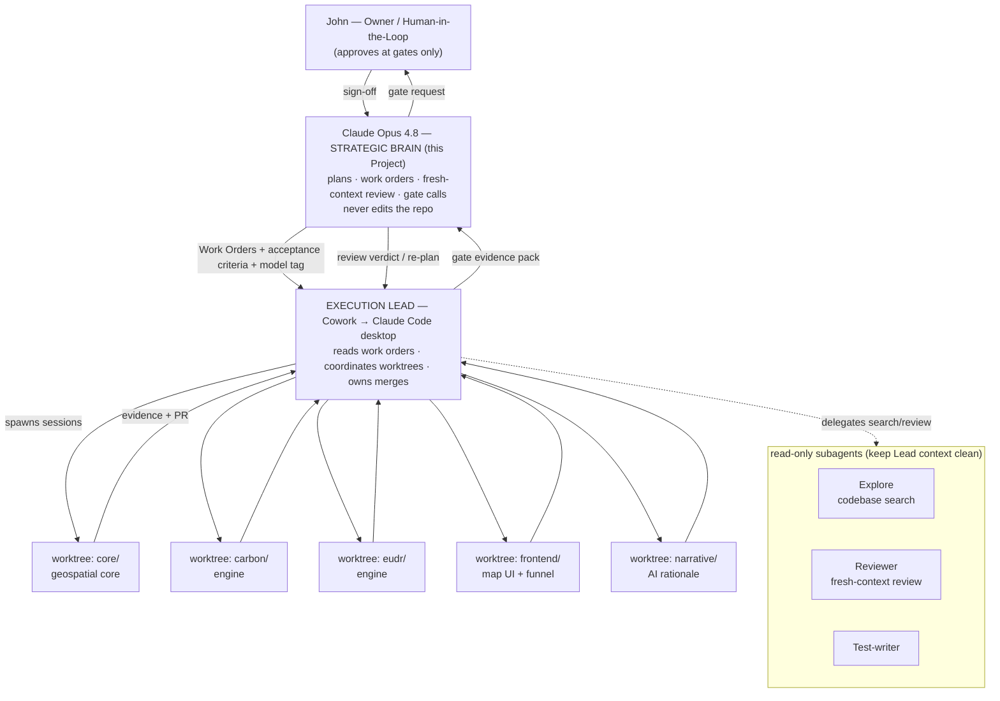
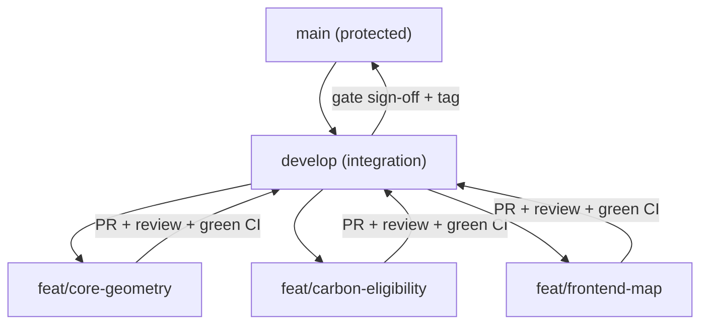
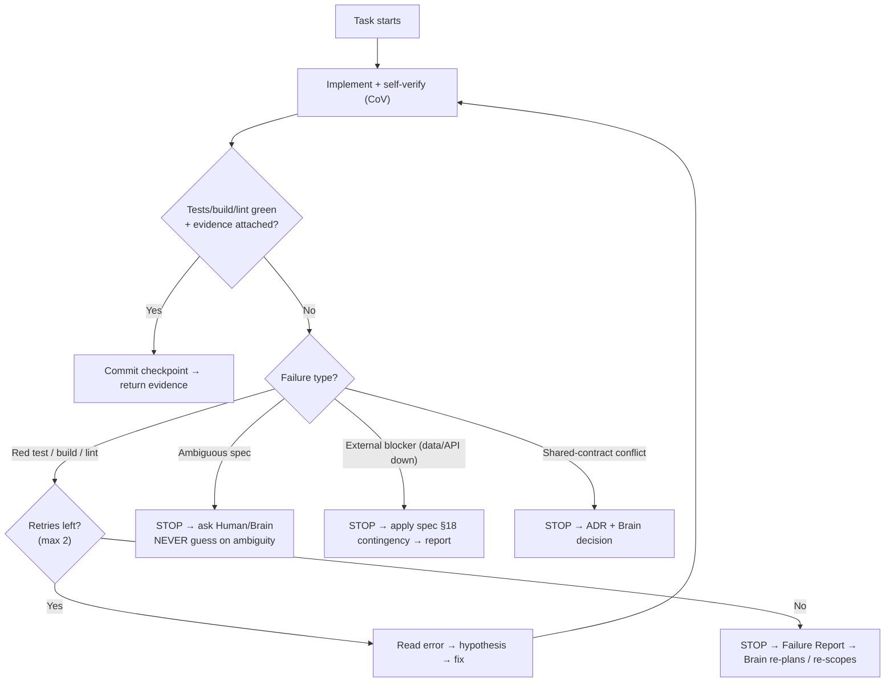

# 180Climate — Build & Orchestration Plan
### How the Brain (Opus 4.8) and the Hands (Cowork → Claude Code) build the Forest Carbon Pre-FS + EUDR platform

**Owner:** John (180climate) · **Strategic Brain / Architect of record:** Claude (Opus 4.8) · **Compiled:** 21 Jun 2026
**Companion to:** `180climate-MASTER-handover-spec.md` (the *what*). This document is the *how* — the operating model, harness, model assignment, human gates, retry/token controls, versioning, deploy, and the exact messages handed to the build agent.

> **Reading order.** The MASTER spec is the single source of truth for product, methodology, scope, and acceptance criteria. **This plan never overrides the spec's *what*; it defines the *how*.** Where the two disagree on product facts, the spec wins; where they disagree on process, this plan wins.

**Acronyms spelled out on first use:** HITL = Human-in-the-Loop · CoV = Chain-of-Verification · DAG = Directed Acyclic Graph · WO = Work Order · ADR = Architecture Decision Record · CI = Continuous Integration · PR = Pull Request · MCP = Model Context Protocol · FDE = Forward Deployed Engineer · GEE = Google Earth Engine · COG = Cloud-Optimized GeoTIFF · PII = Personally Identifiable Information · CLI = Command-Line Interface · DDS = Due Diligence Statement.

---

## 0. The honest mechanics — "Cowork" vs "Claude Code" (read this first)

You asked for Cowork to be the hand and Opus 4.8 to be the brain, with worktree managers instructing worktrees. Here is what that means operationally, stated plainly so nothing surprises you mid-build:

- **The coding engine is Claude Code.** Git worktrees, subagents, hooks, permissions, headless runs — all of that machinery lives in **Claude Code**, the agentic coding tool.
- **Cowork is the surface you drive it from.** Cowork is the agentic desktop app for non-developers; it can use Claude Code (and Chrome, Excel, etc.) as tools. So "let Cowork be the hand" operationally means: *you run the build in Claude's desktop app, where its Code capability (Claude Code) executes inside the harness I configure.*
- **I (Opus 4.8, in this Project) am the Brain.** I never touch the repository. I produce the architecture, the task DAG, one Work Order per task, the acceptance criteria, the model assignment, and the fresh-context code reviews; I make the go/no-go calls and define the human gates.

**One hard constraint to design around:** per Anthropic's Claude Code documentation, **a subagent cannot spawn another subagent**, and subagents cannot show you permission prompts (so any "ask" rule a subagent hits is auto-denied). That kills the naive "manager subagent that spawns worker subagents" tree. The supported way to get your *brain → worktree-managers → worktrees* picture is:

| Your mental model | What it actually is |
|---|---|
| Brain | Me (Opus 4.8) in this Project — plans, reviews, gates. Doesn't edit code. |
| Worktree manager | An **Execution Lead** session in Claude Code that reads Work Orders and **coordinates separate worktree *sessions***. (Anthropic's productized version of this is **Agent Teams** — a team lead with member sessions, shared tasks and messaging.) |
| Worktrees | One Claude Code **session per independent module**, each in its own git worktree + branch (`core/`, `carbon/`, `eudr/`, `narrative/`, `frontend/`). |
| Helpers | **Read-only subagents** (Explore for codebase search, Reviewer for fresh-context review, Test-writer) that keep the Lead's context clean. They never do the merges; the Lead (with you, via permission prompts) does. |

So parallelism that *writes* code = parallel **worktree sessions**, not nested subagents. Read-only fan-out (search, review) = subagents. This is both the documented pattern and the safe one.

### Orchestration topology



---

## 0.1 Where this runs — the friction-least surface

The friction you're feeling is structural: the **brain** (a web chat) is blind to files, so *you* become the relay that shuttles file contents to it. The fix is to put every file-dependent task where files are actually visible, and reserve the blind web chat only for reasoning that needs no files.

**Recommended arrangement (lowest friction, and the FDE-native pattern):**
1. **One workspace — the Claude desktop app.** It puts chat, Cowork, and Claude Code in a single app that can see your local `180climate-app/` folder. (You already have Cowork, so you likely already have this surface.)
2. **The build runs as a Claude Code session there**, Sonnet 4.6 as the default, with **plan mode on Opus 4.8** (or the `opusplan` alias) for the hard design + review steps and a read-only **reviewer subagent**. All of this is **file-aware** — it reads and edits the repo directly, with **no copy-paste relay from you.** Because model-switching (`/model`), plan mode, subagent models, and `opusplan` are all native to Claude Code, collapsing brain + hands into one surface does **not** cost you Opus quality where it matters.
3. **Connect GitHub** (push the repo + add the GitHub connector). This gives you versioning and the portfolio, and lets any chat — including this Project — read the repo directly instead of through your paste buffer.
4. **Keep this Project as the domain/strategy brain**, but only for judgment calls that need no files: methodology defensibility, the "is this credible to a skeptical funder" read, the hard ADRs. Those are reasoning, not file-reading — I can do them from a pasted output or summary, so they never cost you folder-shuttling.

**Net effect:** you stop doing the low-value relay (pasting file contents for review) and only show up for the seven high-value HITL gates in §12, which are quick approvals, not bandwidth. *(This resolves D9.)*

**Watching both work together (your two-view goal).** The desktop app is designed to run **multiple local sessions at once, each in its own worktree.** So the cleanest way to *see* the orchestration is two windows on the **same local repo**: **Cowork** as the orchestrator in one, and a **Claude Code** session (the Code surface in the same app, or a terminal) as the executor in the other. You watch Work Orders go out and commits + evidence come back through the shared repo in near-real-time — that *is* the two-view picture, and it doubles as a great way to learn the pattern. Set one expectation so it matches reality: "exchanging info" here is **not** two chat windows messaging each other — it is an **orchestrator and an executor coordinating through the shared repo** (tasks out, commits/evidence back), which is what you watch in the two panes.

**Caution on the mixed setup you proposed — *Cowork on desktop + Claude Code on the web does not give you this.*** Claude Code on the web runs in an Anthropic-managed **cloud VM** with the repo cloned from GitHub, so it and your **local** desktop Cowork sit on **different filesystems** and can only sync through GitHub push/pull — which is asynchronous and **re-introduces exactly the relay you are trying to escape.** The browser itself (Edge or any modern Chromium browser) is fine; it's the **cloud-vs-local split** that breaks real-time exchange. For two views working together in real time, keep **both on the same machine (desktop).**

**One alternative — if you'd rather not manage any local toolchain (git / Node.js) at all:** run the build with **Claude Code on the web**, where Anthropic clones your GitHub repo into a managed cloud VM and the agent operates on all the files there; you review in the browser, with zero local setup. This is a fine path **only if you give up the live two-view co-run** — it suits fire-a-task-and-review-async work, not watching Cowork and Claude Code exchange in real time.

---

## 1. TL;DR and the decision gate

**The build runs as five phase-gated rounds**, each ending in a quantified scorecard and (for the high-stakes ones) a compulsory human sign-off. Carbon vertical ships first as a standalone milestone; EUDR is a fast-follow reusing the shared core. Everything is built in the open on a public GitHub repo, versioned with SemVer, and deployed as a standalone app on a `180climate.net` subdomain linked/embedded from the Wix site.

**Headline answers to your direct questions:**

- **Which model for the hands?** A **tiered assignment**: **Opus 4.8** for orchestration, all code review, and the *deterministic number path* (carbon calc, eligibility gates, EUDR cutoff verdict — where a silent bug is expensive); **Sonnet 4.6** as the default implementer for everything well-specified and lower-risk (frontend, API wiring, glue, DDS pack assembly); **Haiku 4.5** for boilerplate (scaffolding, fixtures, formatting, commit messages). Full matrix in §3, with a token-vs-babysitting **dial**.
- **Handover mechanism?** A structured **Work Order** per task + the **repo as shared memory** (CLAUDE.md, ADRs, typed contracts, golden cases) + a **gate evidence pack** back to me. Detailed in §2 and §16.
- **Max retries / token control?** **≤ 2 autonomous retries per task**, then STOP and escalate; kill bad trajectories rather than salvage; per-phase token ceilings; checkpoint-commit discipline. §10.
- **Long-term memory / dreaming?** Repo-as-memory + an agent journal + Anthropic's **Dreaming** (between-session memory curation) with a manual "dream/retro" fallback at each gate. §8.
- **Self-improving 3-phase?** Applied to *every* Work Order: Generate → Verify (Chain-of-Verification) → Rewrite, gated by an adaptive-effort check. §9.

**Before any code is written, you confirm the decision gate.** These are the spec's Section 19 `[CONFIRM]` items plus four new ones this plan surfaces. My recommendation is pre-filled; you confirm or amend.

> **Status — 21 Jun 2026.** **Confirmed and locked:** **D1** (methodology-agnostic), **D2** (Wix → standalone app on a subdomain, link-out + optional iframe), **D3** (light capture up front, detailed report gated), **D5** (Carbon first, EUDR fast-follow), **D6** (peat = agnostic + advisor-confirm — transparent range, never branded to VM0027). **D4:** store = email + Google Sheet (locked); one micro-item open — the canonical lead inbox (recommended: `info@180climate.net` as primary, the spec's `leoniches@gmail.com` as CC/fallback). **D7 (model):** resolved — the Cowork project default = **Sonnet 4.6**; Opus 4.8 stays with the Brain (see §3). **D8 (HITL gates), D9 (environment), D10 (Earth Engine):** recommendations in §12 / §3 / §14 stand unless you amend.

| # | Decision | Recommendation (confirm / amend) |
|---|---|---|
| D1 | Methodology stance | **Methodology-agnostic engine** (transparent avoided-emissions range) + narrative cites the correct Verra family by permit type. Do **not** hard-code one method. |
| D2 | 180climate hosting (site is **Wix**) | Wix can't host a custom React + FastAPI app. Build a **standalone app on a subdomain** (e.g. `app.180climate.net` or `tools.180climate.net`), **linked from the Wix nav and iframe-embedded** on a landing page. Needs you to add a DNS/subdomain in Wix domain settings. |
| D3 | Funnel gating | **Light capture up front** (name/email to see the headline verdict + map), **detailed report + financial-model carrot gated** behind the full lead form. |
| D4 | Lead store | **Email + Google Sheet append.** Confirm the delivery inbox — site shows `info@180climate.net`; the spec says `leoniches@gmail.com`. **Which is canonical?** |
| D5 | Build order & public scope | **Carbon vertical first → ship → EUDR fast-follow.** Confirm whether v1 public scope includes EUDR or Carbon-only is the first public release. |
| D6 | Peat methodology numbers | **VM0027 now**, flagged "interim — standalone Tropical Peatland method in development," or hold peat numbers until the standalone method lands? |
| D7 | **Model dial** (new) | Default tiering in §3. Push more to **Opus** to minimize rework/babysitting, or more to **Sonnet** to minimize token spend? Default = the balanced tiering. |
| D8 | **Compulsory HITL gates** (new) | Confirm the seven gates in §12 (you review at: plan, slice, methodology/numbers, EUDR verdicts, shared-contract changes, PII/lead flow, go-live). |
| D9 | **Build environment** (new) | Confirm you can run **Claude Code via the desktop app** with local **git + Node.js**, so worktrees/subagents/hooks work. (Alternative: Claude Code on the web, cloud VMs — less direct for HITL + token visibility.) |
| D10 | **GEE licensing** (new) | GEE is free for **non-commercial** use only; this is a commercial lead-gen tool. Accept GEE for the portfolio MVP with a flagged caveat, or go **self-hosted COGs / direct free APIs** from day one to avoid the issue? Recommended: **build the data layer behind an interface so the source is swappable**, ship MVP on free APIs/COGs where possible, flag GEE in README + ADR. |

**Nothing is handed to Cowork until D1–D10 are confirmed (that is Gate 0).**

### Phase-gate flow

```mermaid
flowchart LR
  P0["P0 · Foundations<br/>(no parallel agents)"] --> G0{{"Gate 0 — HUMAN<br/>plan + ADRs + contracts"}}
  G0 --> P1["P1 · Vertical Slice<br/>(the spine, sequential)"]
  P1 --> G1{{"Gate 1 — HUMAN<br/>slice green end-to-end"}}
  G1 --> P2["P2 · Carbon Engine<br/>(parallel worktrees)"]
  P2 --> GM{{"Gate M — HUMAN<br/>methodology + numbers + disclaimers"}}
  GM --> P3["P3 · EUDR Engine<br/>(reuses core)"]
  P3 --> GE{{"Gate E — HUMAN<br/>2020 verdicts + DDS pack"}}
  GE --> P4["P4 · Harden + Ship"]
  P4 --> GL{{"Gate L — HUMAN<br/>go-live + PII + brand"}}
  GL --> Live["Live on 180climate.net"]
```



---

## 2. The handover protocol (how Brain talks to Hands)

The single most important thing for a clean multi-session build is that **the hands never have to guess what the brain meant.** Three artifacts carry all the context; nothing else is "in my head."

### 2.1 The repo *is* the shared long-term memory
Everything durable lives in version control so any fresh session reconstructs full context from disk:

```
180climate-app/
  CLAUDE.md            # the constitution: stack, conventions, guardrails, "how we work here"
  docs/
    methodology.md     # Verra-family routing (spec §9) — the accuracy source of truth
    adr/               # ADR-0001.. — every irreversible decision, dated
    spec.md            # the MASTER handover spec (committed)
    plan.md            # this document (committed)
    agent-journal.md   # append-only: what each session learned / what broke (feeds Dreaming)
  core/                # shared geospatial core; typed contracts FIRST
  engines/{carbon,eudr}/
  narrative/           # prompt templates per engine
  frontend/
  api/                 # FastAPI routes
  tests/               # golden-case fixtures + unit tests
  .claude/
    agents/            # custom subagents (reviewer, explorer, test-writer)
    commands/          # slash commands for repeated workflows
    settings.json      # permissions + hooks (committed, team-shared)
    skills/            # project skills (methodology, geospatial, brand, golden-case, self-improving-code)
```

### 2.2 The Work Order (one per task) — the unit of handover
I never say "go build the carbon engine." I emit **discrete Work Orders**, each scoped to a single task an agent can finish and prove. Template:

```markdown
## WO-<ID> · <short title>
**Phase:** <P0..P4>   **Model:** <opus-4.8 | sonnet-4.6 | haiku-4.5>   **Worktree:** <branch>
**Depends on:** <WO-IDs that must be green first>
**Objective:** <one sentence — the outcome, not the steps>

**In scope:** <files/modules this WO may create or change>
**Out of scope / do NOT touch:** <shared contracts, other modules>
**Contracts:** READ-ONLY <interfaces it consumes>   WRITABLE <only its own interface>

**Acceptance criteria (testable — Definition of Done):**
- [ ] <criterion mapped to spec §15>
- [ ] unit tests + golden cases pass in CI
- [ ] <evidence required: test output / screenshot / sample JSON>

**Self-improving loop:** required (Generate → CoV → Rewrite). Effort: <LOW/MED/HIGH>.
**Retry budget:** 2 autonomous retries, then STOP + Failure Report.
**HITL gate:** <none | name of the human gate this WO blocks>
**Evidence to return:** <exact artifacts the Lead must surface to the Brain>
```

### 2.3 The gate evidence pack (Hands → Brain)
At each gate the Lead returns a pack I review with **fresh context** (no bias toward code I "wrote," because I didn't): the diff/PR, the test + golden-case output, screenshots of the UI, sample engine outputs for the golden concessions, the token burn for the phase, and the agent-journal delta. Per Anthropic's guidance: **show evidence, don't assert success.** I issue a review verdict (pass / fix-list / re-plan) and, for human gates, a recommendation to you.

---

## 3. Model assignment — answering "which model for the Cowork project?"

**Direct answer: set the Cowork project default to Sonnet 4.6.**

**Your observation is essentially right.** On the Max plan, Claude Code's default model is Opus 4.8, and the Cowork project asks you to pick a model up front. Under the hood Claude Code *can* switch models mid-session (the `/model` command, and project settings reapply on the next launch) — but the Cowork project surface presents this as one standing choice, so we plan as if the Cowork project runs **one model** for the whole build, and you actively select **Sonnet 4.6**.

**Why Sonnet 4.6 and not Opus 4.8 for Cowork — the key insight: two Opus brains is wasteful.** The deep reasoning in this build does not live in Cowork; it lives with **me, the Opus 4.8 Brain in this Project.** I do the architecture, I design the high-stakes logic, and I run every authoritative code review. So Cowork's job is to *execute* well-specified Work Orders against locked contracts and deterministic golden-case tests — and for that, Sonnet 4.6 is the efficient frontier:
- It handles roughly 90% of coding tasks at near-Opus quality, at roughly 40–80% lower token cost — which is what keeps a ~2-week solo build inside Max limits.
- The safety net for the number path is **my design + the deterministic golden-case tests + my Opus review** — not the implementer's raw model tier. A wrong number fails a committed test regardless of who wrote the code.
- Running Cowork on Opus too would mean paying Opus rates to re-derive reasoning you already get from the Brain, and burning the budget faster.

So the split is: **Opus where reasoning and review live (me); Sonnet where execution lives (Cowork).** That is the whole point of brain-and-hands.

| Layer | Model | Where it runs |
|---|---|---|
| Strategic Brain: architecture, design of high-stakes logic, **all authoritative code review**, gate calls | **Opus 4.8** (effort: **xhigh** for coding-adjacent reasoning) | **This Project** (not Cowork) |
| Hands: execute Work Orders — engines, frontend, API, glue, fixtures, narrative plumbing | **Sonnet 4.6** | **The Cowork project** (single standing default) |

**The per-Work-Order `Model:` tag now means "stakes flag," not a literal Cowork model switch.** When a Work Order is tagged `opus-4.8` (e.g. eligibility gates, methodology routing, the EUDR 31-Dec-2020 verdict), it signals: *I (the Brain) do more of the design up front, write tighter acceptance criteria and more golden cases, and review that pull request harder.* Cowork still implements it on Sonnet — the extra Opus rigor is applied by me, before and after.

**Optional upgrades, only if the surface exposes them (all optional — the Brain already covers review):**
- **`opusplan`** — if you ever run a piece in raw Claude Code rather than (or alongside) Cowork, this alias *is* the brain/hands split inside one session: Opus plans, then auto-switches to Sonnet to execute. Opus-quality planning without Opus-rate execution.
- **Subagent model** — Claude Code lets a subagent carry its own model (subagent frontmatter / the `/agents` picker). If Cowork exposes it, the in-Cowork `reviewer` subagent could run on Opus. Not required, because my review is authoritative.
- **Max auto-fallback** — when Opus quota is exhausted, Claude Code automatically falls back to Sonnet, so the Brain session degrades gracefully rather than stalling.

**Haiku 4.5 — minimized, per your instruction.** No separately-managed Haiku tier that you have to relay between me and. Cowork runs Sonnet for everything, boilerplate included. *Optionally*, the Cowork Lead may use a Haiku subagent silently for pure mechanical work (formatting, fixture scaffolding) to save tokens — but that is an internal optimization inside Cowork, never something you operate or shuttle messages for.

**Update — your chosen surface (Claude Code in VS Code).** Because your coding now runs in **Claude Code inside VS Code** (not the single-standing-default Cowork *project*), **model-switching is native** — so the full tiering is back on the table, exactly as originally intended. Set the VS Code Claude Code default to **Sonnet 4.6**, then type **`/model opus`** for the high-stakes number path and code reviews, or use **`opusplan`** to automate the split (Opus plans, Sonnet executes). The single-model limitation applied only to the Cowork project surface; it does not constrain Claude Code in VS Code. Cowork, used as your orchestrator window, runs Sonnet 4.6.

---

## 4. The harness (what shapes the hands)

The "harness" is Claude Code plus the configuration that constrains and equips it. We commit all of it so every session and every future reader (your FDE portfolio) inherits the same discipline.

**`CLAUDE.md` — the constitution.** Committed, shared, the file Claude auto-reads in the repo. Holds: the stack, the module-boundary rule ("change only behind your own interface; shared types change only by ADR"), commit/branch conventions, the runtime-is-deterministic / build-is-multi-agent rule, the disclaimer policy, and the "show evidence, never assert" rule. Skeleton in §16.

**`.claude/settings.json` — permissions + hooks.** Committed at project scope.
- **Permissions:** allow read + test/lint/build bash; **ask** before write/commit/push and before any destructive bash; deny network egress to anything outside the allowlisted data/source domains.
- **Hooks (guardrails that run automatically):**
  - `PreToolUse` → **secret scanner** (block any Write/commit containing keys/tokens; exit code 2 = deny) and a **dangerous-bash veto** (block `rm -rf`, force-push to `main`, etc.).
  - `PreToolUse` → **contract-guard**: block edits to `core/contracts/*` unless the WO is flagged as a contract change (forces the ADR path).
  - `Stop` → **verification gate**: don't let a session declare done until tests + golden cases are green and evidence is attached.

**`.claude/agents/` — custom subagents (read-only by default).**
- `reviewer` — fresh-context adversarial code review (the in-repo arm of the self-improving loop). Read-only tools.
- `explorer` — codebase/search to answer "where is X / what calls Y" without polluting the Lead's context.
- `test-writer` — drafts golden-case fixtures and unit tests from acceptance criteria.

**`.claude/commands/` — slash commands for repeated inner-loop work** (e.g. `/golden-check`, `/new-adr`, `/phase-scorecard`, `/journal`). Shortcuts, not workflow orchestration — keep them simple.

**Plugins (optional discipline layer).** A "won't let you skip planning/tests/evidence" plugin (e.g. a Superpowers-style workflow pack) enforces the same gates the hooks do. Adopt if you want belt-and-suspenders; the hooks already cover the essentials.

---

## 5. Worktrees & parallelism

**Rule from the spec, reinforced by Anthropic's docs:** parallel sessions editing the same checkout overwrite each other; a **worktree gives each session its own working directory + branch sharing one git history.** So parallel *writing* = separate worktrees.

- **When to parallelize:** only across **genuinely independent** modules, and only after the vertical slice is green and the typed contracts are frozen (the "constitution"). The spec's own seams: `core`, `carbon`, `eudr`, `narrative`, `frontend`.
- **How many at once:** for a solo, HITL, token-budgeted build — **2–3 worktrees in flight**, not a 5–10 swarm. More than that and you can't review the evidence or watch the burn. Sequential is the default; parallel is the exception for truly independent legs.
- **Hygiene:** `.claude/worktrees/` in `.gitignore`; one branch per worktree (`feat/core-geometry`, `feat/carbon-eligibility`, …); the Lead owns merges to a `develop` integration branch; only reviewed, green code reaches `main`.
- **Collision contingency (spec §18):** contracts/types first; if two worktrees need a shared type changed, **both stop**, the Brain writes an ADR, the change lands once, then they resume. No worktree unilaterally edits a shared contract — the contract-guard hook enforces this.



---

## 6. Dynamic skills to adopt and author

You asked me to pick the right skills from Anthropic's development/PM/programming toolkit. Two buckets: **enable** existing public skills, and **author** project-specific ones in `.claude/skills/`.

**Enable (already exist):**
- `frontend-design` — design-token / styling discipline for the map UI + funnel (used with the brand pack in §15).
- `skill-creator` — to *build* the project skills below cleanly.
- `doc-coauthoring` — for the README, methodology notes, and ADR prose.
- `mcp-builder` — only if we decide to wrap a data source as an MCP server (probably not needed; see §7).
- `self-improving-agent` — the 3-phase loop, adapted for code (§9).

**Author (project-specific, version-controlled):**
- **`methodology`** — encodes spec §9 routing (HTI→APD/clear-fell; HA→IFM/selective; Peat→peat method; never brand to VM0007). The narrative session loads this so it always cites the correct Verra family. *This is the accuracy backbone.*
- **`geospatial`** — input parsing (coords / shapefile / GeoJSON), area + boundary, GFW/Hansen/RADD/JRC query patterns, free-tier source list, uncertainty-band language. Loaded by the core worktree.
- **`golden-case`** — how to turn an acceptance criterion (spec §15) into a committed fixture with expected output. Loaded by `test-writer`.
- **`brand-180climate`** — the color/font tokens in §15 so every UI surface matches the Wix site.
- **`self-improving-code`** — the per-Work-Order Generate→Verify→Rewrite loop (§9), with a code-flavored flaw taxonomy (LOGIC BUG / OFF-BY-ONE / UNHANDLED INPUT / CONTRACT DRIFT / SILENT-WRONG-NUMBER / MISSING TEST).

> Skills are *folders, not files* — use `references/`, `scripts/`, `examples/` for progressive disclosure so a session pulls only what it needs (token discipline).

---

## 7. MCP choices & settings

Keep the MCP footprint **deliberately small** — every MCP server is a trust decision (there have been real CVEs in MCP servers), and sprawl burns context. Separate **build-time** (what the agent uses while building) from **runtime** (what the deployed app uses).

**Build-time MCP (for Cowork/Claude Code):**
- **GitHub MCP** — issues, PRs, releases, tags. This is the backbone of your versioning + portfolio workflow (§13). *Primary.*
- **Playwright/Chrome MCP** — drive the frontend in a real browser to capture screenshots for the Reviewer and for visual QA. (Anthropic's guidance: *visual inputs often beat text descriptions* — a screenshot communicates faster than a paragraph.) *Secondary, add at P2/frontend.*
- Filesystem MCP is **not needed** — Claude Code has native file tools.

**Runtime (the deployed app) uses none of Claude's MCP connectors.** Lead delivery (email + Google Sheet append) is done by the *app's own* backend using its own credentials — **not** your personal Gmail/Drive MCP connectors. Keep that boundary crisp: your connectors are for *your* Claude sessions, not for the public app's runtime.

**MCP settings/posture:** scope each server tightly; never pipe untrusted repo content into a privileged tool; review tool calls before approval; keep MCP definitions in `.claude/settings.json` (committed) so the trust surface is auditable.

---

## 8. Long-term memory & "Dreaming"

Three layers, strongest to lightest:

1. **Repo-as-memory (durable, human-auditable).** CLAUDE.md + ADRs + `docs/methodology.md` + typed contracts + golden cases. Any fresh session reconstructs full project state from disk. This is the memory that *can't drift* because it's reviewed and versioned.
2. **Agent journal (session learnings).** `docs/agent-journal.md` — append-only. At the end of every session the agent records what it learned, what broke, and what to avoid next time. This is the raw material for curation.
3. **Dreaming (between-session curation).** Anthropic's **Dreaming** feature is a scheduled process that reviews agent sessions and memory stores, extracts patterns (recurring mistakes, workflows agents converge on, shared preferences), and curates the memory so it stays high-signal — and so agents *preload* those learnings next run. It runs *between* sessions, not during. The practical payoff: the system should get measurably better the longer it runs, without manual intervention.

> **Availability caveat:** Dreaming was announced in 2026 and its exact availability on your plan/surface may vary — check Anthropic's current docs/announcements. **If it isn't available to you, the fallback is a manual "dream" step the Brain runs at each gate:** I read the journal + session logs, extract the lessons, and fold them into CLAUDE.md and the project skills. Same outcome — self-improvement at the project level — just human-triggered. Either way, the loop is real and the memory compounds.

---

## 9. The self-improving-agent 3-phase loop, applied to code

Every Work Order runs the loop (adapted from your `self-improving-agent` skill), gated by effort:

**Phase 0 — Adaptive effort.** Trivial WO (config, a fixture) → skip the loop, just do it. Medium (a route, a parser) → Generate + Verify, no full rewrite. High (the calc, eligibility gates, the 2020-cutoff verdict) → full loop. The agent states `[EFFORT: HIGH]` at the top.

**Phase 1 — Generate.** Implement to the acceptance criteria. Flag any assumption inline `[ASSUMPTION: …]`.

**Phase 2 — Verify (Chain-of-Verification).** Three adversarial questions aimed at the weakest parts, answered as a skeptical reviewer, then a **Flaw Log** with a code-flavored taxonomy:

```
FLAW LOG
[FLAW-1] Type: SILENT-WRONG-NUMBER | UNHANDLED INPUT | OFF-BY-ONE | CONTRACT DRIFT | MISSING TEST
         Location: <file:line>
         Test case: <one concrete input where this fails>
         Fix: <specific correction + the test that now covers it>
```
If genuinely clean: `[VERIFICATION PASSED — no material flaws]` and stop.

**Phase 3 — Rewrite.** Apply the fixes; add the tests that would have caught each flaw; append a `CHANGES v1→v2` delta to the PR.

**Cross-family check (highest stakes only).** Your skill's cross-family protocol exists to fight *self-enhancement bias* — a model favoring its own logic. In *this* build the structural version of that protocol is: **the Opus Brain reviews with fresh context what a Sonnet/Opus implementer produced** — a different session/role grading the work, which is exactly the bias mitigation. For the *methodology/number* claims specifically (Gate M), you (the domain expert) are the external adversarial reviewer — no model finalizes the Verra mapping or the additionality language without you.

---

## 10. Failure & retry protocol + token control

This is how we stop a runaway session from quietly burning your Max budget.

**Retry budget: ≤ 2 autonomous retries per task (3 attempts total).** Each retry must be *informed* — read the error, state a hypothesis, fix — never a blind re-run. After the second failed retry: **STOP. Do not spend more tokens.** Write a Failure Report and escalate.

**Failure taxonomy (different failures route differently):**



**Kill bad trajectories.** Anthropic's guidance: don't salvage a rotting context — *checkpoint frequently and be willing to restart.* If a worktree is thrashing, revert to the last green commit, re-scope the Work Order more tightly, start a fresh session. A clean restart from a good checkpoint is cheaper than babysitting a confused one.

**Token guardrails:**
- **Per-phase ceiling.** Each phase gets a usage budget; the Brain reviews burn at the gate. If a phase blows past its ceiling, that itself triggers a STOP-and-review (D7 dial may need adjusting).
- **Context hygiene.** Offload search/large reads to read-only subagents so the Lead's context stays lean; let Claude Code compact older context; keep Work Orders small.
- **Checkpoint discipline.** Commit at every green step so a reset costs nothing.
- **Failure Report format** (cheap to read, prevents repeat spend):
  ```
  FAILURE REPORT · WO-<ID>
  Attempts: 3/3   Tokens this WO: ~<n>
  What was tried: <attempt 1 / 2 / 3 in one line each>
  Error / blocker: <exact message or condition>
  Hypothesis: <best current theory>
  Blocking question for Brain/Human: <the single decision needed>
  Last green checkpoint: <commit hash>
  ```

---

## 11. Quantify & qualify success at each round

Every phase has an explicit **scorecard** — quantitative gates (machine-checkable) and qualitative gates (judgment). A phase isn't "done" until both are satisfied. All criteria trace back to spec §15.

| Phase | Quantitative (must pass) | Qualitative (must judge) |
|---|---|---|
| **P0 Foundations** | Repo scaffolds; CI runs green on an empty test; typed contracts compile; all ADRs for D1–D10 committed | Architecture reads cleanly; module boundaries unambiguous; Brain + you approve the plan |
| **P1 Vertical slice** | One concession → parse → GFW query → placeholder number → map + verdict + AI rationale → capture → email, **end-to-end green in CI**; ≥1 golden case passes | "Ugly but real" — the whole pipe demonstrably connects; no fake stages |
| **P2 Carbon engine** | All 4 hard gates correct on golden cases; methodology routes by permit type and names the right Verra family; outputs a **range** with stated uncertainty; map renders loss overlay; coverage on the number path ≥ target; deterministic (same input → same output) | Narrative explicitly states "legal harvest right foregone" additionality; numbers are *defensible to a skeptical funder*; disclaimer present and brief |
| **P3 EUDR engine** | Correct deforestation-free/non-compliant verdict vs **31 Dec 2020** on golden cases; commodity tagged; Indonesia risk tier stated; valid GeoJSON DDS pack (TRACES-aligned); correct deadline from config | Verdict framing is the *opposite* of carbon and unambiguous; legality rendered as a checklist/attestation (not a false computed claim) |
| **P4 Harden + ship** | No secrets in repo; README + architecture diagram + methodology notes + disclaimers present; free-tier deploy reproducible from README; CI green on `main`; Lighthouse/UX baseline met | Looks professional and credible on the live subdomain; brand matches the Wix site; lead pipeline verified with a real test submission |

**Success of the *whole build*** = Carbon vertical live on `180climate.net`, public GitHub repo a clean FDE portfolio piece (README, diagram, ADRs, green CI, SemVer releases), EUDR shipped or clearly staged, real leads landing in the inbox + Sheet.

---

## 12. Compulsory Human-in-the-Loop gates (define the high-stakes checkpoints)

You said you'll come in for the high-stakes, compulsory HITL moments — here they are. "High-stakes" = irreversible, public-facing, touches money/legal/credibility, handles real PII, or changes a shared contract. At each, the agent **must stop and get your sign-off**; it may not proceed on its own.

| Gate | When | What you review / decide | Why it's compulsory |
|---|---|---|---|
| **Gate 0 — Plan** | Before any code | D1–D10 confirmed; ADRs; task DAG; model assignment; contracts | Everything downstream inherits these; cheapest place to be right |
| **Gate 1 — Slice** | After vertical slice | The end-to-end demo + evidence | Prevents widening the *wrong* spine via parallel agents |
| **Gate M — Methodology & numbers** | Carbon engine done | Golden-case outputs, the Verra-family mapping, the additionality language, the disclaimer | This is *your professional credibility* to rival developers and funders. No model finalizes the methodology mapping without you. |
| **Gate E — EUDR verdicts** | EUDR engine done | 2020-cutoff verdicts on golden plots, the DDS pack schema, the legality-checklist framing | A wrong "deforestation-free" verdict is a serious, reputational error |
| **Gate C — Shared-contract change** | Any time a worktree needs a shared type changed | The ADR + the proposed contract change | A unilateral contract edit breaks parallel work silently |
| **Gate P — PII / lead flow** | Before lead capture goes live | Where contact data is stored, the email + Sheet flow, basic data hygiene | Real personal data from real prospects — must be deliberate, not default |
| **Gate L — Go-live** | Before public deploy | Disclaimers present, **no secrets in repo**, lead pipeline tested, brand correct, positioning copy approved, GEE caveat documented | Public + reputational + effectively irreversible |

Plus a standing **spend gate**: any phase exceeding its token ceiling pauses for your continue/adjust decision.

---

## 13. GitHub & versioning (your portfolio backbone)

Build in the open from a clean first commit — this *is* the FDE exhibit.

> **Terminology (used precisely throughout this plan).** *git* = the version-control system and all **local** operations: `init`, `commit`, `branch`, `worktree`, `merge`, `tag`, `.gitignore`, history. *GitHub* = the **hosting/collaboration platform**: the remote repository, Pull Requests, Issues, Releases, **Actions** (the CI runner), branch-protection rules, and the GitHub MCP server. Worktrees and commits are *git*; the public repo, pull requests, and release notes are *GitHub*.

- **Repo:** public `180climate-app`. **License:** Apache-2.0 or MIT (portfolio-friendly), with a README note on the **GEE non-commercial caveat** and the swappable data layer.
- **Branch model:** trunk-based with short-lived branches. `main` **protected** (no direct pushes, no force-push — enforced by hook + branch protection); `develop` integration branch; `feat/*` per worktree. **Nothing reaches `main` unreviewed** (spec §13).
- **Commits:** **Conventional Commits** (`feat:`, `fix:`, `docs:`, `test:`, `refactor:`, `chore:`) → enables an auto-generated `CHANGELOG.md` and clean SemVer.
- **SemVer + release tags mapped to milestones:**

| Tag | Milestone |
|---|---|
| `v0.1.0` | Vertical slice green (P1) |
| `v0.2.0` | Carbon engine complete (P2 / Gate M) |
| `v0.3.0` | EUDR engine complete (P3 / Gate E) |
| `v1.0.0` | **Public MVP live on 180climate.net** (P4 / Gate L) |
| `v1.x` | Post-launch fixes/iteration |

- **GitHub Releases** with notes per tag (auto from Conventional Commits).
- **CI (GitHub Actions):** on every PR run lint + unit tests + golden cases; **block merge on red**; build a deploy preview. On tag → deploy to production. (Headless Claude Code can also run in Actions for an automated review pass, but the *human* review at gates stays.)
- **ADRs** in `docs/adr/` — every irreversible decision, dated, the methodology stance front and center.
- **Portfolio polish:** README with the architecture diagram (the Mermaid in this doc renders natively on GitHub), a "how it works," the defensible methodology notes, and the disclaimers. This is what a recruiter or funder will actually read.

---

## 13.1 Backup & working across laptops

Your code's cloud backup is **git + GitHub**, not Google Drive — and it's both safer and easier for moving between machines.

- **Why not Google Drive for the repo.** Drive syncs files the instant they change. A live repo has hundreds of constantly-changing files in `.git` (and folders like `node_modules` with tens of thousands of files); Drive tries to sync them mid-write, causing lock errors, `.git` corruption, and duplicate "sync conflict" copies. Drive is great for your *documents* — not for an active code repo.
- **How GitHub solves backup + sync.** Every time the repo is *pushed*, a full copy plus its complete history lives on GitHub's servers. On a new laptop you install git + VS Code + the Claude Code extension, run `git clone <your-repo-url>`, and the whole project lands ready to use — one clean copy, no half-synced mess. You also get full version history (roll back to any prior state), which Drive can't do for code.
- **Private first, public when ready.** WO-000 creates the repo **private** (backed up immediately, nothing exposed). You flip it to **public** for the portfolio whenever you choose — one toggle in GitHub settings.
- **You don't need to be a git expert.** Claude Code runs the git commands for you — commit, push, and the clone/pull on a new machine — so you mostly just approve.
- **The rhythm:** work locally in `C:\dev\180climate-app` (fast, no conflicts); Claude Code commits at each green step and pushes to GitHub regularly (your backup); keep Drive for documents only.

**New-laptop checklist:** install [git](https://git-scm.com), [VS Code](https://code.visualstudio.com), and the Claude Code extension → sign in to Claude (Max) → `git clone <your-repo-url>` into `C:\dev\` → **File → Open Folder** on it → keep building. Nothing is lost; everything is on GitHub.

---

## 14. Deploy & go-live on 180climate.net

The site is **Wix**, which can't host a custom React + FastAPI app — so the architecture is **standalone app + link/embed from Wix** (decision D2).

- **Subdomain:** `app.180climate.net` or `tools.180climate.net` (you add the DNS/subdomain record in Wix's domain settings). Linked from the Wix nav and **iframe-embedded** on a dedicated landing page so it feels native to the site.
- **Frontend** (React + MapLibre/Leaflet): free tier — Vercel / Netlify / GitHub Pages.
- **API** (FastAPI + geopandas/rasterio/shapely): free/cheap tier — Render / Fly / Railway.
- **Secrets:** never in the repo; injected via the host's environment config; the secret-scan hook is the backstop.
- **Data layer:** behind an interface so the source is swappable (D10) — ship MVP on free APIs / self-hosted COGs where possible; flag the GEE non-commercial caveat in README + ADR; reserve paid high-resolution imagery for flagged plots only (your established cost-variable principle).
- **Lead pipeline:** app backend emails the confirmed inbox (D4) + appends to a Google Sheet for a durable record; verified end-to-end at Gate P with a real test submission before go-live.

---

## 15. Brand pack (so the UI matches the Wix site)

Extracted from the live 180climate site and logo. The app should feel like a native extension of it.

**Colors**

| Token | Hex | Use |
|---|---|---|
| `--brand-green` (primary) | `#5FA304` | Primary actions, the carbon vertical, active states, the leaf accent |
| `--brand-green-deep` | `#4A8000` | Hover/pressed, depth, headings-on-light |
| `--brand-lime` | `#8BC53F` | Highlights, the logo-gradient accent, success ticks |
| `--brand-slate` (secondary) | `#417586` | The EUDR vertical accent, secondary buttons, data-viz, links |
| `--brand-slate-light` | `#6298AA` | Secondary fills, info chips |
| `--ink` | `#1F1F1F` | Headings |
| `--text` | `#3D3D3D` | Body text |
| `--muted` | `#8F8F8F` | Captions, helper text, disclaimers |
| `--bg` | `#FAFAFA` | App background (a faint warm off-white) |
| `--surface` | `#FFFFFF` | Cards, the map panel |
| `--border` | `#E2E2E2` | Dividers, input borders |
| Semantic | success `#5FA304` · warning `#E0A800` · danger `#C0392B` · info `#417586` | Verdict chips, validation |

**Fonts** (chosen to match the site while staying free / portfolio-clean — no licensing snags):
- **Headings:** **Space Grotesk** (present in the site's stylesheet; geometric, distinctive — fits a climate-tech brand).
- **Body / UI:** **Inter** (closest free analog to the site's Wix Madefor; ubiquitous, highly legible).
- **Data / code:** **JetBrains Mono** (engine outputs, coordinates, GeoJSON).

**Feel:** clean, scientific, trustworthy — generous whitespace, the leaf-green reserved for primary action and the carbon vertical, the slate-teal as the EUDR vertical's signature so the two engines are visually distinct but clearly one product. The brief disclaimer always present, in `--muted`, never legalistic.

---

## 16. Communications to Cowork (the actual messages)

These are the concrete artifacts I hand over. Drafts you'll see populated once D1–D10 are confirmed.

### 16.0 Cowork project background (paste this into the Cowork project's instructions)

This is the standing instruction for the Cowork project itself — the project-level brief the app carries across every run. It is the Cowork-surface companion to the repo's `CLAUDE.md`; both point at the same source of truth.

```text
You are the PLANNING & ORCHESTRATION agent for the 180climate-app build. Three roles exist: the
STRATEGIC ARCHITECT (a separate Claude Opus 4.8 Project) owns the spec, contracts, Work Orders, and
gate decisions; YOU (Cowork) turn each Work Order into a concrete execution plan, track progress, and
review results; and a separate CODING agent (Claude Code in VS Code) writes the actual code in the
shared local repo. You plan and coordinate — you do NOT write the production code yourself (that is the
coding agent's job), so you never collide on the same files.

Source of truth, in order: docs/spec.md, docs/plan.md, CLAUDE.md, docs/methodology.md, docs/adr/.
Read them before acting. If they conflict with this note on PRODUCT facts, the spec wins.

How we work here:
- Work in discrete Work Orders, handed to you one batch per phase. One Work Order = one finishable,
  provable task. Do not invent scope beyond the active Work Order.
- Runtime is DETERMINISTIC: the engine computes every number/verdict; the AI only writes the
  explanation. Never put a model call in the number path.
- Change code only behind your own module's interface. Shared contracts in core/contracts/ change
  ONLY via an ADR and a human sign-off (Gate C). Never edit a shared contract unilaterally.
- Run the self-improving loop per Work Order: Generate -> Verify (Chain-of-Verification, with a
  Flaw Log) -> Rewrite. Effort scales with the task's tag.
- Retry budget: at most 2 informed retries on a failure, then STOP and write a Failure Report.
  Never guess on an ambiguous spec -- stop and ask the Brain/human. Kill and restart a thrashing
  session from the last green commit rather than salvaging it.
- SHOW EVIDENCE, never assert success: the test output, the command and what it returned, or a
  screenshot. Commit at every green step using Conventional Commits.
- No secrets in the repository, ever. Keep user-facing disclaimers brief and non-legalistic.
- COMPULSORY human gates -- stop and wait for John's sign-off; do not proceed alone: the plan, the
  vertical slice, the carbon methodology + numbers, the EUDR verdicts + DDS pack, any shared-contract
  change, the PII/lead flow, and go-live. A phase that exceeds its token ceiling also pauses.
- At each gate, assemble an evidence pack (PR/diff, CI + golden-case output, screenshots, sample
  engine outputs, token burn, journal delta) and hand it to the Brain for fresh-context review.
  Do NOT self-certify a gate.

git vs GitHub (use precisely): git = local version control (commit, branch, worktree, merge, tag).
GitHub = the remote platform (the repository, Pull Requests, Issues, Releases, Actions/CI, branch
protection). main is protected on GitHub; nothing reaches it unreviewed.

Model: this project runs on Sonnet 4.6. The Opus-grade reasoning and review come from the Brain.
Do not relay messages between the Brain and any Haiku helper through John; any Haiku use is an
internal optimization only.
```

### 16.1 `CLAUDE.md` skeleton (the constitution)
```markdown
# 180climate-app — Working Agreement (read me first)

## What this is
Two domain engines (Carbon Pre-FS, EUDR Export Readiness) on one shared geospatial core.
Runtime = DETERMINISTIC calculator + AI narrative. The number path has NO LLM in it.
Build = multi-agent. Source of truth: docs/spec.md, docs/methodology.md, docs/adr/.

## How we work here
- Change code ONLY behind your own module's interface. Shared contracts in core/contracts/
  change ONLY via an ADR + human (Gate C). The contract-guard hook enforces this.
- Every task = one Work Order. Run the self-improving loop (Generate → CoV → Rewrite) per its effort tag.
- Retry budget: 2 autonomous retries, then STOP and write a Failure Report. Never guess on ambiguity — ask.
- SHOW EVIDENCE, never assert success: test output, the command + its result, or a screenshot.
- Commit at every green step (Conventional Commits). Nothing reaches main unreviewed.
- No secrets in the repo, ever. Keep the disclaimer brief and non-legalistic.

## Stack
Python/FastAPI + geopandas/rasterio/shapely (calc) · React + MapLibre (frontend) ·
Claude Haiku/Sonnet for narrative · free-tier hosting. Data sources behind a swappable interface.

## Definition of Done
spec.md §15 acceptance criteria + green CI (unit + golden cases) + evidence attached.
```

### 16.2 Sample Work Order — the spine (P1)
```markdown
## WO-001 · Vertical slice spine (end-to-end, ugly but real)
Phase: P1   Model: opus-4.8 (number path stub) + sonnet-4.6 (wiring)   Worktree: feat/spine
Depends on: WO-000 (repo scaffold + contracts)
Objective: One sample concession flows end-to-end and renders a verdict + map + rationale, and a
           lead email is sent. Prove the whole pipe connects before anything is widened.

In scope: api/ (one route), core/ (parse + area + one GFW query), a PLACEHOLDER carbon number,
          frontend/ (map + verdict + rationale render), lead capture → email.
Out of scope / do NOT touch: real biomass/peat logic, methodology routing, parallel modules,
          core/contracts/* (consume only).

Acceptance criteria:
- [ ] Sample concession (coords AND shapefile) parses to a boundary + area; malformed input → clear error
- [ ] GFW forest-loss query returns and renders as a map overlay
- [ ] Placeholder number + brief disclaimer render in the report layout
- [ ] Capture form submits → email received (test inbox)
- [ ] One golden case committed; CI green end-to-end

Self-improving loop: required, EFFORT: MED.   Retry budget: 2 → STOP + Failure Report.
HITL gate: Gate 1 (slice).   Evidence: CI run link, screenshot of the rendered report, the test email.
```

### 16.3 Sample Work Order — the dangerous math (P2)
```markdown
## WO-CARBON-003 · Eligibility gates + methodology routing
Phase: P2   Model: opus-4.8   Worktree: feat/carbon-eligibility
Depends on: WO-CORE-* (geometry + area), WO-CARBON-001 (data integration)
Objective: Apply the 4 hard gates and route methodology by permit type, naming the correct Verra family.

In scope: engines/carbon/eligibility.py, engines/carbon/routing.py
Out of scope: shared contracts (consume only), narrative wording (separate WO), frontend
Contracts: READ-ONLY core/contracts/Geometry, ConcessionInput; WRITABLE engines/carbon/* only

Acceptance criteria (spec §15):
- [ ] Gates: valid HTI/HA, >5yr remaining, ≥20,000 ha, inside-IUP → correct eligible/flagged/hard-NO
- [ ] Routing: HTI→APD/clear-fell; HA→IFM/selective; Peat→peat method; output names the Verra family
- [ ] NEVER routes the foregone-legal-harvest baseline to the unplanned VM0048/VMD0055 family
- [ ] Deterministic: same input → same output; full golden-case suite green
- [ ] Each gate + each routing branch has a test that would catch a regression

Self-improving loop: required, EFFORT: HIGH (run full CoV — flaw type SILENT-WRONG-NUMBER is the risk).
Retry budget: 2 → STOP.   HITL gate: Gate M (methodology & numbers — John signs off).
Evidence: golden-case output table for all permit types, the routing decision log, coverage on this module.
```

### 16.4 Reviewer subagent prompt (`.claude/agents/reviewer.md`)
```markdown
You are an adversarial code reviewer with FRESH context. You did NOT write this code.
Tools: read-only. Do not edit; only identify issues.
For this diff, find:
  1. Three logic or correctness flaws (favor SILENT-WRONG-NUMBER, UNHANDLED INPUT, OFF-BY-ONE).
  2. One missing test — name the exact input that is currently uncovered.
  3. One place the code drifts from docs/spec.md §15 or docs/methodology.md.
Output a Flaw Log (Type / Location file:line / Test case / Fix). If genuinely clean, say so and stop.
Determinism check: confirm no LLM call sits in the number path.
```

### 16.5 Kickoff message to the Execution Lead
```markdown
You are the Execution Lead for the 180climate-app build. Read, in order:
docs/spec.md, docs/plan.md, CLAUDE.md, docs/methodology.md, the open ADRs.

We run phase by phase. You will receive Work Orders one batch per phase. Rules:
- Sequential by default. Parallelize ONLY genuinely independent modules, ONLY after the slice is green
  and contracts are frozen, and at most 2–3 worktrees at once.
- Each parallel module = its own worktree + branch. You own merges to develop. Nothing to main unreviewed.
- Delegate search/review to the read-only subagents (explorer, reviewer, test-writer) to keep your context clean.
- Enforce the retry budget (2 → STOP + Failure Report). Kill and restart bad trajectories from the last green commit.
- At each gate, assemble the evidence pack (diff/PR, CI + golden-case output, screenshots, sample engine
  outputs, token burn, journal delta) and hand it back to the Brain for fresh-context review. Do NOT
  self-certify a gate. Wait for the human sign-off before proceeding.

Start with P0: confirm the repo scaffold and typed contracts compile, then report. Do not start P1 until I send the P1 Work Orders.
```

### 16.6 Gate-review request format (Lead → Brain → John)
```
GATE <0/1/M/E/C/P/L> REVIEW REQUEST
Phase: <..>   Tag candidate: <vX.Y.Z>   Token burn this phase: ~<n> (ceiling <m>)
Scorecard: quantitative <PASS/FAIL per row>   qualitative <notes>
Evidence: <PR link> · <CI run> · <golden-case output> · <screenshots> · <sample outputs>
Journal delta: <key lessons this phase>
Open questions for human: <none | list>
```

---

## 17. Timeline (within the ~5 Jul 2026 window)

Indicative, carbon-first so a shippable milestone exists even if EUDR slips past the window.

| Window | Phase | Exit |
|---|---|---|
| Day 0–1 | **P0 Foundations** + confirm D1–D10 | Gate 0 (you) |
| Day 1–3 | **P1 Vertical slice** | Gate 1 (you) → tag `v0.1.0` |
| Day 3–8 | **P2 Carbon engine** (2–3 worktrees) | Gate M (you) → tag `v0.2.0` |
| Day 8–9 | **P4-lite for Carbon: harden + deploy Carbon to subdomain** | Gate P + partial Gate L → **Carbon MVP live** |
| Day 9–13 | **P3 EUDR engine** (reuses core) | Gate E (you) → tag `v0.3.0` |
| Day 13–14 | **P4 Harden + ship full** | Gate L (you) → tag `v1.0.0` |

> If the window tightens, **Carbon-only is the public v1** (D5) and EUDR ships right after — the shared core means EUDR is a fast-follow, not a restart.

---

## 18. Risk → orchestration mapping (from spec §18)

The spec's risks, mapped to the controls in this plan:

| Risk | Control here |
|---|---|
| Methodology dispute (VM0048 vs APD/IFM) | Methodology-agnostic engine + `methodology` skill routes by permit; Gate M human sign-off; ADR-0001 |
| App dates itself on a deprecated method | Anchor to the verified registry (spec §9); never brand to VM0007; `methodology.md` is canonical |
| EUDR deadlines shift again | Dates config-driven, labeled "as of Jun 2026"; one config change, no code change |
| Free data too coarse for a plot | Uncertainty bands in `geospatial` skill; FS/site-visit positioned as the precision upgrade (carrot) |
| GEE non-commercial trips launch | Data behind a swappable interface (D10); flag in README + ADR; free APIs/COGs for MVP |
| Additionality challenged | "Legal harvest right foregone" enforced in narrative + golden cases; visible sources |
| Parallel agents collide | Contracts-first; contract-guard hook; ADR for shared changes; ≤3 worktrees; Lead owns merges |
| Runaway token burn | Retry budget ≤2; per-phase ceilings; spend gate; kill-and-restart; subagents keep context lean |
| Lead data lost | Email + Google Sheet append (D4); verified at Gate P |
| Wix can't embed | Standalone app on subdomain + iframe/link (D2) |

---

## Appendix A — Gate 0 checklist (do this first)
- [ ] D1–D10 confirmed (or amended) by John
- [ ] Repo `180climate-app` created (public), license chosen, `main` protected
- [ ] `docs/`: spec.md, plan.md, methodology.md committed; ADR-0001 (methodology stance) written
- [ ] Typed contracts in `core/contracts/` drafted and compiling
- [ ] `.claude/`: settings.json (permissions + hooks), agents (reviewer/explorer/test-writer), CLAUDE.md
- [ ] Project skills authored (methodology, geospatial, golden-case, brand-180climate, self-improving-code)
- [ ] GitHub MCP wired; CI workflow runs green on an empty test
- [ ] Model assignment + token ceilings per phase agreed (D7 dial set)
- [ ] HITL gates (§12) confirmed
- [ ] **Then, and only then,** the P1 Work Orders go to the Execution Lead

## Appendix B — Sources consulted (for the methodology of *this plan*)
- Anthropic — Claude Code best practices (plan mode; Writer/Reviewer; show evidence; worktrees; "speed is a trap").
- Anthropic — Claude Code subagents & settings (own context/prompt/tools; cannot spawn subagents; read-only recommended; hooks; permission precedence).
- Anthropic — Code with Claude 2026: Dreaming (between-session memory curation), multi-agent orchestration / Agent Teams.
- The 180Climate MASTER handover spec (product, methodology §9, acceptance criteria §15, risks §18).
- The `self-improving-agent` skill (3-phase loop, Chain-of-Verification, adaptive effort, self-enhancement-bias mitigation).
- 180climate.net (live site + logo) for the brand pack.

*Confirm the decision gate (D1–D10) and I'll populate the repo scaffold, the ADRs, and the first batch of Work Orders for the Execution Lead.*
