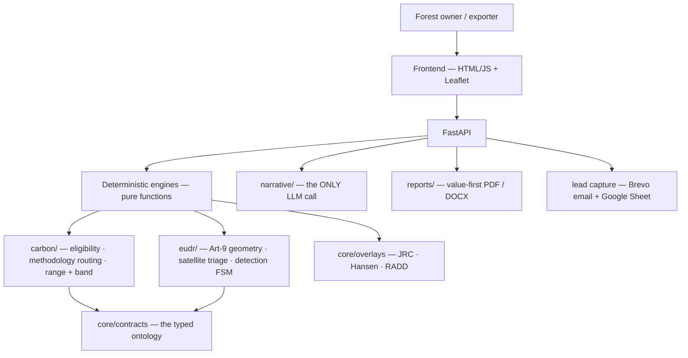
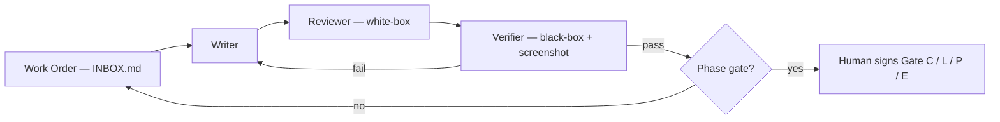

# 180Climate — Carbon & EUDR Pre-Feasibility Platform

**Two production web apps that give Indonesian forest owners and commodity exporters a real answer in minutes — built almost entirely through a multi-agent AI development pipeline, with a human in the loop only at decision gates.**

[](https://github.com/TengKianBoon/180climate-app/actions)


[](https://carbon.180climate.net)
[](https://eudr.180climate.net)

> Deterministic engine · AI writes only the explanation · 18 ADRs · 463 passing tests · green CI (mypy + pytest) · SemVer releases · shipped in 8 days.

This repository is published in the open as a worked example of **forward-deployed engineering with agentic tooling**: how you take two fuzzy real-world problems to two live, defensible products — fast — without the AI ever inventing a number or a legal claim. It is written to be read, not just run.

---

## 1. The two apps — what they are and why they exist

### 🌱 Carbon Pre-Feasibility Engine — `carbon.180climate.net`
An Indonesian concession holder (HTI timber-plantation or HA natural-forest permit) enters contact details and a concession location (coordinates or a GeoJSON boundary) and gets, free and in minutes: an indicative **carbon-credit quantity as a range with an uncertainty band and an IPCC Tier label** (never a single hero number, never a "% accuracy" claim), a **forest-loss map overlay**, an **auto-routed methodology** (REDD+ / IFM / peat), and a plain-language AI rationale.

**Why it's needed:** a paid pre-feasibility study runs ~SGD 12,000 and weeks of back-and-forth. Most owners never find out whether their land has a fundable carbon project. This turns that first, expensive "is it even worth it?" question into a free, self-serve screen — and a trust-building entry point to 180Climate's paid advisory.

### 🌍 EUDR Export Readiness Engine — `eudr.180climate.net`
An Indonesian exporter of palm, rubber, timber, cocoa, or coffee uploads their plots and gets a **per-plot red / amber / green triage** against the EU's own satellite forest maps (JRC GFC2020 + Hansen + RADD), with each finding explained in real numbers (hectares of loss, share of plot, which dataset, the 31 Dec 2020 cutoff), an **Art-9 geolocation pack** for DDS preparation, an **Indonesia-specific legality checklist**, a **who-files-the-DDS** explainer, and a satellite map locating every plot.

**Why it's needed:** the **EU Deforestation Regulation** starts biting on **30 December 2026** — goods grown on land cleared of forest after 2020 get blocked from the EU. Indonesian producers urgently need to know *which of their plots are a problem* and *what to prepare*. Crucially, this is positioned as a **triage & DDS-preparation screen, never a compliance verdict** — the honest posture is baked into the type system (see §6).

Both apps share one geospatial core, one report generator, one lead pipeline. A palm concession owner often needs *both* answers — carbon upside **and** EUDR market access — so the two live side by side, each with its own branded entry link.

---

## 2. What makes this repo worth reading

The product is useful. The **way it was built** is the point of this write-up:

- A **deterministic runtime** — pure functions and typed models produce every number and verdict. The only LLM call in the whole product is the module that writes the human explanation. Numbers are reproducible, testable, cheap.
- A **multi-agent development pipeline** — a planner/orchestrator agent, a builder agent, an independent adversarial "advisor" agent, and a human who owns the truth and signs the gates.
- **Layered verification** — every unit of work passes Writer → Reviewer → Verifier before it's accepted; contracts change only through an ADR; a class of dangerous claims is blocked by a guard test in CI.
- **Durable memory** — the pipeline learns across sessions and context resets through a two-tier file memory and a consolidation ("dreaming") pass.

Everything below maps a piece of modern agentic-engineering vocabulary to **where it actually happened in this build** — because the fastest way to lose a technical reader's trust is to name-drop a concept you didn't really use.

---

## 3. Architecture — the deterministic spine



```
docs/          methodology.md · 18 ADRs · application-plan · orchestration-v2 · eudr-value-first
core/          shared geospatial core · contracts/ (ontology) · overlays/ · data/
engines/       carbon/ · eudr/            narrative/  the ONLY LLM call
reports/       value-first PDF + DOCX     api/  FastAPI      frontend/  HTML/JS + Leaflet
tests/         463 passing                coordination/  agent mailbox + board.html
```

**Stack:** Python 3.13 · FastAPI · Pydantic v2 · rasterio / shapely (COG pixel reads over `vsicurl`) · Leaflet (OSM + Esri World Imagery) · Claude (narrative only) · Render (host) · Brevo (email).

**The module-boundary rule (the ontology):** `core/contracts/` is the typed constitution — every engine and the API consume it, and a shared-type change requires an **ADR + a Gate-C sign-off, enforced by a contract-guard hook.** It is a genuine **domain ontology**: the `detection` state machine (`clear_in_screen` / `loss_detected` / `inconclusive` / `geometry_invalid`), the methodology enums, the uncertainty band + IPCC tier, the EUDR role and commodity enums. Because the vocabulary is typed and central, no downstream code *can* emit a claim the domain forbids.

---

## 4. The agent operating model — two views, four roles, one folder

| Role | Who | Job |
|------|-----|-----|
| **Planner / Orchestrator** | Claude (Cowork) | Turns each Work Order into steps, reviews the builder's output against acceptance criteria, assembles gate evidence, keeps the board. Writes no production code. |
| **Builder (the harness)** | Claude Code (VS Code) | Writes, runs, tests, and commits the code. Its task is always the shared `coordination/INBOX.md`. |
| **Adversarial advisor** | Claude (a separate Claude.ai project) | Independent stress-testing and divergence checks — deliberately *not* the builder, so review isn't marking its own homework. |
| **Architect / Owner** | The human | Sets the spec, makes gate decisions, defines truth. Agents prove conformance; **they never self-certify a gate.** |

**Why two views (Cowork + VS Code) over one shared folder:** planning/evaluation and writing/compiling are *different cognitive jobs* — separating them keeps each agent's context clean and prevents the classic failure of an agent grading its own work. Pointing both at the **same folder** (rather than passing files around) means there is exactly **one source of truth**: the builder commits, the planner reads the committed result, the human opens the same `board.html`. Coordination happens through plain files in `coordination/` (`INBOX` → `OUTBOX` → `STATE` → `journal` → `GATE`), which doubles as a fully auditable trail.

*Guiding line from the repo constitution:* **"Agents prove conformance; the human defines truth."**

---

## 5. The loop — designed for long-running autonomous programming



Two design choices make this safe to run for long, mostly-unattended stretches:

1. **A bounded retry budget (2, then stop).** An agent that can't satisfy the acceptance criteria in two tries writes a `QUESTIONS.md` and halts instead of thrashing. Failure is *escalated*, not hidden.
2. **Phase gates.** At each phase boundary the pipeline writes `GATE x READY` + evidence and **stops** for a human sign-off. No agent advances its own phase.

Bounded loops + durable state on disk + hard human checkpoints — the practical shape of "**let the agent run long, but never let it run unchecked**."

---

## 6. Guardrails, hooks, and quantified verification

**Invariants (guardrails) — enforced, not hoped for:**
- **Determinism.** Pure functions + typed models. The *only* LLM call is in `narrative/`.
- **Contracts change only via an ADR + Gate C** — a **contract-guard hook** blocks un-ADR'd edits to `core/contracts/`.
- **Uncertainty is honest.** Always a **range + band + IPCC Tier**, never a single number, never a "% accuracy/confidence" string.
- **Methodology routing is fixed** (HTI→APD, HA→IFM, peat→interim); mis-routing is a test failure.
- **Banned-claim guard.** A CI test asserts EUDR output can never contain `"compliant"`, `"deforestation-free"`, or `"DDS-ready"` — the legal posture lives in the type system and the test suite, not just the copy. (It caught real regressions during the build.)
- **No secrets in the repo.**

| Control | Detail |
|--------|--------|
| Automated tests | **463 passing** (pytest), 355 test functions across 124 files |
| Type safety | `mypy` on the contract layer, in CI |
| CI | GitHub Actions — mypy + pytest on every push, green |
| Black-box acceptance | the **Verifier** runs the built product against the spec + screenshots the UI; may run commands but may **not** edit files |
| Independent review | a separate advisor agent runs divergence checks at gates |
| Human gates | **Gate C** (contracts) · **L** (carbon go-live) · **P** (lead pipeline) · **E** (EUDR) — each signed on assembled evidence |
| Audit trail | append-only `journal.md`, `OUTBOX.md` per Work Order, `board.html` |

---

## 7. Product definition — interviews, spec, and sign-off

Requirements were **elicited and signed off**, not guessed:

- A **value-first first principle** was interviewed out of the domain owner and written down (`docs/ux-value-first.md`, `docs/eudr-value-first.md`): *the user leaves with a real answer, how to grow it, what we caught, and a clear next step — rigour running invisibly underneath.* Every screen and line was filtered through it.
- The **EUDR legal posture** ("triage, not a compliance verdict") was stress-tested by the independent advisor **before** building, and folded into ADR-0018 and the contracts.
- Each phase closed with a **gate sign-off** on real evidence (tests, renders, a live end-to-end run).

The owner's recurring instruction — *"don't be so conservative that no one uses it"* — became an engineering lever: watch the amber/inconclusive rate on real runs and tune the detection threshold toward green as data allows, while **never** letting a genuine loss render green. Value and rigour, held in tension on purpose.

---

## 8. Memory & "dreaming" — learning across context resets

The pipeline runs longer than any single context window, so it remembers on disk: a **two-tier file memory** (a working `MEMORY.md` index + one fact per file in `memory/`) and an **append-only episodic journal** feeding a **consolidation ("dreaming") pass**. Concretely — when a sandbox quirk corrupted working-copy reads, "verify against committed git blobs" was written to memory and *stayed* fixed across sessions; when the owner said "always give me a clickable file, never make me hunt the repo," that became a durable behaviour. The difference between an agent that repeats mistakes and one that sharpens over a week.

---

## 9. MCP, skills, and the model choice

**MCP (Model Context Protocol).** The agent harness (Cowork / Claude Code) is MCP-native — it discovers and calls tools through MCP. The *product's* external tools — the **GFW Data API** (RADD/Hansen), the **JRC GFC2020** COG, **Brevo**, **Google Sheets** — are consumed directly today and are exactly the surface MCP standardises; exposing them as MCP servers is the natural next step. *(Stated plainly: MCP powered the development harness, not yet a production server — no fabricated claims.)*

**Skills.** Reusable, invokable capabilities were used where they earned their place — most visibly the **self-improving-agent** skill (Chain-of-Verification / recursive stress-testing) to harden the EUDR value-first spec before a line of it was built.

**Why the Claude family throughout:** one model family across planner, builder, and advisor means **consistent instruction-following and a shared reasoning style** — which matters enormously when agents read and enforce *each other's* contracts and gate rules. Within that family, work was routed for economics: **Sonnet by default, Opus for the number-path Work Orders and their reviews**, with parallel git worktrees capped at ~3 to stay in budget. Homogeneity is a feature: fewer translation seams, more predictable guardrails.

---

## 10. Vocabulary → where it actually happened

| Concept | In this build |
|---|---|
| Agentic loop | Writer→Reviewer→Verifier per Work Order; retry budget 2 then STOP+ask |
| Multi-agent orchestration | 4 roles: planner, builder, adversarial advisor, human gates |
| Harness | Claude Code (VS Code) + Cowork (Agent SDK) against a shared repo |
| Context engineering | `coordination/` mailbox + `CLAUDE.md` + per-WO briefs |
| Sub-agents / parallelism | git worktrees for parallel Work Orders, capped ~3 |
| Verifiers / evals | black-box Verifier + 463 pytest + mypy + banned-claim guard + screenshots |
| Guardrails | determinism · contracts-via-ADR · uncertainty band · methodology routing · banned strings |
| Hooks | contract-guard (no `core/contracts` change without an ADR) |
| Determinism | pure-function engines; LLM in exactly one module (`narrative/`) |
| Ontology | `core/contracts/` — the typed domain vocabulary both engines speak |
| MCP | MCP-native harness; external data tools as the integration surface |
| Skills | self-improving-agent (Chain-of-Verification) to stress-test the spec |
| Memory / consolidation ("dreaming") | two-tier file memory; episodic journal → consolidation |
| ADRs | 18 architecture decision records |
| Human-in-the-loop gates | Gate C/L/P/E — agents prove conformance, the human signs |

---

## 11. Scope — what's deliberately deferred, and why (anti-over-engineering)

Shipping fast means **knowing what not to build yet.** This is an MVP that solves the user's problem end-to-end; the items below are **known, understood, and consciously deferred** to avoid over-engineering ahead of real usage. Each is a clean next chapter, not an oversight — the same *right-size-the-rigour* discipline the product itself follows ("don't over-conserve"):

- **Observability & monitoring** (error tracking, request tracing, uptime, dashboards) — add when live traffic justifies the instrumentation.
- **Automated eval harness** (LLM-as-judge over the narrative + guardrail red-teaming) — the independent advisor covers the high-stakes review today; this productionises it.
- **Security & abuse hardening** (rate-limiting, dependency scanning, threat model) — before any paid promotion of the public endpoints.
- **Scale & CD** (staging, post-deploy smoke tests, rollback, caching, load testing) — the free tier fits current volume.
- **Product analytics** (funnel instrumentation) — to optimise conversion once there's a steady stream.

Stated as a matter of judgement, not omission: a production hardening phase is planned and understood; building it *before* real usage would be the wrong call. **The full sequenced plan — triggers, approach, and effort per workstream — is in [`docs/production-roadmap.md`](docs/production-roadmap.md).**

**Versioning & release discipline.** Commits follow **Conventional Commits**; releases are tagged **SemVer** (`v1.0.0` = carbon live, `v1.1.0` = EUDR live) with notes. The contract layer is the SemVer surface — a breaking contract change is a major bump, gated by an ADR + Gate C. The full decision history lives in `docs/adr/` and the append-only `coordination/journal.md`.

---

## 12. Timeline

**24 June → 1 July 2026 · 8 days · 114 commits · 18 ADRs · 463 tests · 2 live apps.** Day 1 scaffolded the monorepo, the typed contracts, the `.claude` harness, and CI. The carbon vertical shipped first as a standalone milestone; the EUDR vertical was a fast-follow (29 Jun → 1 Jul) reusing the shared core, and went live after its Gate-E sign-off on 1 July.

---

## 13. Try it & explore the repo

- **Live:** [carbon.180climate.net](https://carbon.180climate.net) · [eudr.180climate.net](https://eudr.180climate.net)
- **Start here:** [`docs/application-plan.md`](docs/application-plan.md) · [`docs/orchestration-v2.md`](docs/orchestration-v2.md) · [`docs/methodology.md`](docs/methodology.md) + [`docs/adr/`](docs/adr/) · [`docs/eudr-value-first.md`](docs/eudr-value-first.md) · [`coordination/board.html`](coordination/board.html)

```bash
pip install -r requirements.txt
uvicorn api.main:app --reload      # → http://localhost:8000
pytest tests/                       # 463 tests
```

---

*Indicative pre-feasibility screening — not a verified carbon issuance, and not a Due Diligence Statement or legal advice. The EUDR screen checks deforestation signals against public satellite data; it does not verify legality, land tenure, or forest degradation. Built by 180Climate.*
