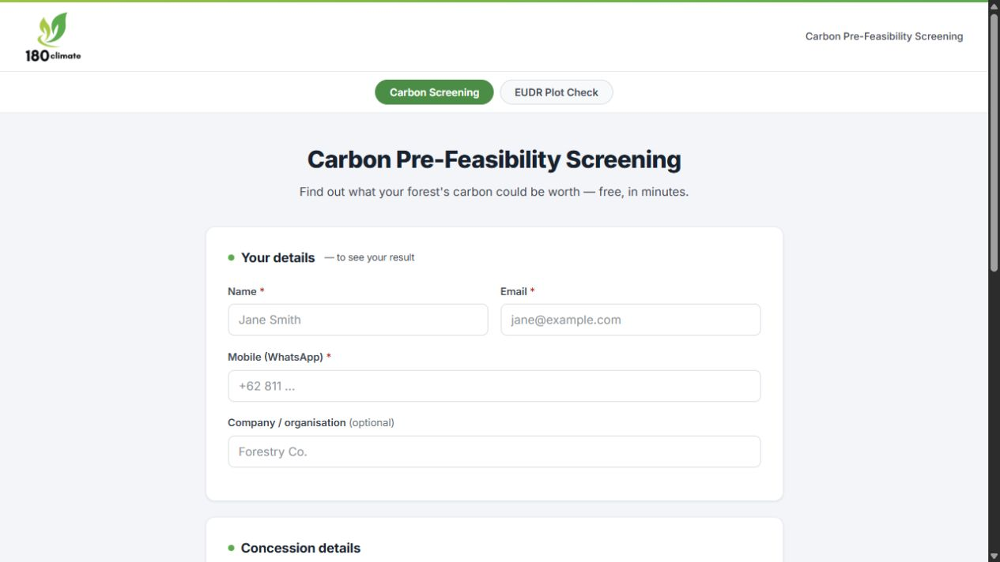
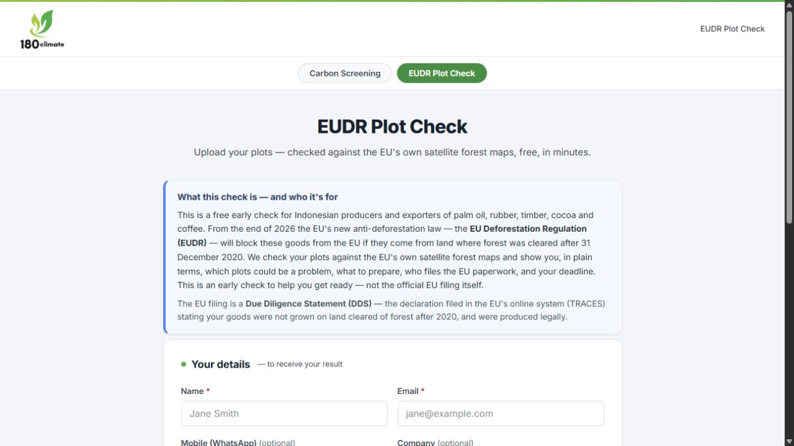
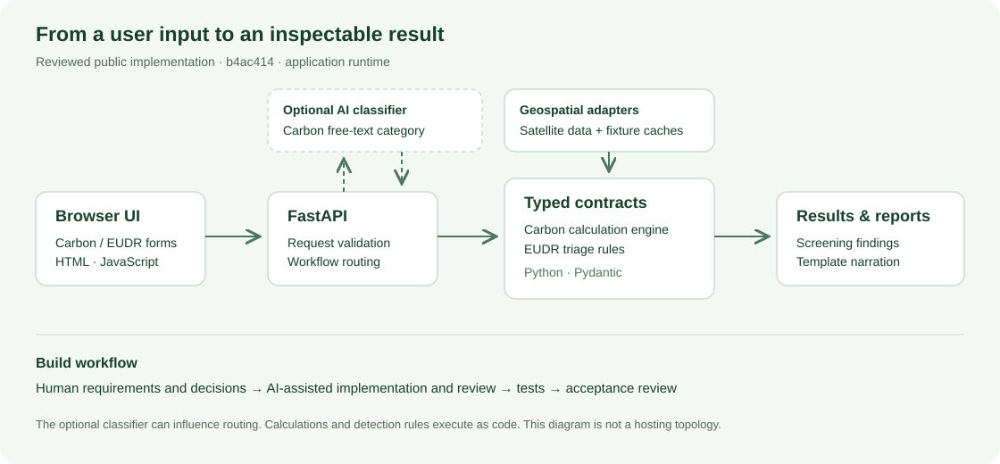

# 180Climate — Carbon & EUDR Pre-Feasibility Platform

Two live web apps that give Indonesian forest owners and commodity exporters a real answer in minutes.

**[carbon.180climate.net](https://carbon.180climate.net)** · **[eudr.180climate.net](https://eudr.180climate.net)** · `v1.1.0` · CI green · 461 passed, 2 skipped (1 July 2026)

I scoped, funded, directed and launched this build. The engineering was executed by an AI harness under my acceptance criteria and gate sign-offs. Sections 1–4 are the product and the evidence; [section 5](#5-my-contribution) states exactly which parts were mine.

---

## 1. See the product

**Carbon Pre-Feasibility Engine** — a concession holder enters a permit type and a location, and gets an indicative carbon-credit quantity as a range with an uncertainty band and an IPCC Tier label, a forest-loss overlay, an auto-routed methodology, and a plain-language rationale. Free, in minutes. The paid equivalent runs about SGD 12,000 and several weeks.



**EUDR Export Readiness Engine** — an exporter uploads plots and gets a per-plot red / amber / green triage against the EU's own satellite forest maps, each finding stated in hectares and share of plot, with an Art-9 geolocation pack and an Indonesia-specific legality checklist. The regulation starts biting on 30 December 2026.



Both are live. Enter a location and the answer comes back from the deployed system, not a mock.

---

## 2. See the architecture



One rule governs the whole design: **every number and every verdict is produced by a pure function over typed models. The only LLM call in the product writes the human-readable explanation.** Numbers are therefore reproducible, testable and cheap, and no model output can invent a quantity or a legal claim.

```
core/contracts/   the typed ontology — detection states, methodology enums,
                  uncertainty band + IPCC tier, EUDR role and commodity types
engines/          pure-function carbon + EUDR                narrative/  the ONLY LLM call
api/  FastAPI     frontend/  HTML/JS + Leaflet               reports/  PDF + DOCX
tests/            461 passed, 2 skipped                      docs/adr/  18 decision records
```

Stack: Python 3.13 · FastAPI · Pydantic v2 · rasterio / shapely (COG pixel reads over vsicurl) · Leaflet · Render · Brevo.

`core/contracts/` is the constitution. A change to it requires an ADR and a Gate-C sign-off, enforced by a hook that blocks un-ADR'd edits. Because the domain vocabulary is typed and central, no downstream code can emit a claim the domain forbids.

---

## 3. See the code

One decision, end to end — the EUDR per-plot triage:

**[`engines/eudr/triage.py` L45–L79](https://github.com/TengKianBoon/180climate-app/blob/b4ac414789659bfbb56f19599a87cbe72a01a2d2/engines/eudr/triage.py#L45-L79)**

It takes measured forest-loss area against a plot geometry and returns one of four detection states — `clear_in_screen`, `loss_detected`, `inconclusive`, `geometry_invalid` — never a compliance verdict. The distinction is the whole legal posture of the product, and it lives in the type system rather than in the copy: the app can say *we found 3.4 ha of loss after the 31 December 2020 cutoff*, and it cannot say *you are compliant*.

That posture was decided before the code was written, stress-tested by an independent review agent, and recorded as **ADR-0018**.

---

## 4. See the tests

**[`tests/test_eudr_triage.py` L50–L90](https://github.com/TengKianBoon/180climate-app/blob/b4ac414789659bfbb56f19599a87cbe72a01a2d2/tests/test_eudr_triage.py#L50-L90)** — the cases that pin the function above, including the boundary between amber and green.

**[Recorded CI run](https://github.com/TengKianBoon/180climate-app/actions/runs/28553478682/job/84655746161)** — 461 passed, 2 skipped, 1 July 2026. mypy on the contract layer plus pytest, on every push.

The test that matters most is the **banned-claim guard**: a CI assertion that EUDR output can never contain the strings `compliant`, `deforestation-free` or `DDS-ready`. It caught real regressions during the build. A marketing instinct to write "deforestation-free" on a results page fails the build rather than reaching a user.

---

## 5. My contribution

I am a C-level operator, not the engineer of record. This section states the split plainly, because the commit history is public and shows an AI co-author on most commits.

**What I owned:**

- **The problem and the business case.** Which two questions were worth answering for Indonesian producers, why a free screen beats a SGD 12,000 study as an entry point, and how the tool feeds 180Climate's paid advisory. Nobody briefed me on this; it came from the client conversations.
- **Scope, timeline and budget.** I set the delivery window and held the build inside it on subscription tooling, routing work by cost — a cheaper model by default, the stronger one reserved for the number-path work orders and their reviews, parallel work capped at about three streams.
- **The acceptance criteria.** Every unit of work carried a definition of done that I wrote. Agents proved conformance against it; they never certified their own gate.
- **The four go-live gates** — contracts, carbon launch, lead pipeline, EUDR launch. Each signed by me on assembled evidence: tests, rendered reports, a live end-to-end run.
- **The judgement calls that shaped the product.** Two examples. First, the EUDR legal posture — triage and DDS preparation, never a compliance verdict — which I set before any EUDR code existed and which became ADR-0018 and the typed detection states. Second, the calibration instruction I gave repeatedly: *don't be so conservative that no one uses it.* Watch the amber rate on real runs and tune toward green as the data allows, while never letting a genuine loss render green. Value and rigour, held in tension deliberately.
- **The development operating model.** I ran planning in one surface and execution in another against a shared repository, customised the sub-agent roles, context and standing instructions, and kept review separate from authorship so no agent marked its own homework.
- **Release and recovery.** Versioning, tagging and the rollback decisions were mine — see [section 6](#6-inspect-versioning-and-recovery).

**What I did not do:** I did not hand-write the production code. The implementation was generated by the harness, reviewed by a separate agent, verified black-box against my criteria, and accepted or rejected by me. Where an agent could not satisfy the acceptance criteria in two attempts, it stopped and asked rather than continuing — that escalation rule is mine, and it is the reason there is no quietly broken code in this repository.

I am publishing it this way because the interesting claim is not *I can code*. It is that a senior operator can take two fuzzy, regulated, real-world problems to two live and defensible products, fast, without the AI ever inventing a number or a legal claim — and can show the receipts.

---

## 6. Inspect versioning and recovery

| Release | What went live | Date |
|---|---|---|
| [`v1.0.0`](https://github.com/TengKianBoon/180climate-app/releases/tag/v1.0.0) | Carbon Pre-Feasibility Engine | 1 July 2026 |
| [`v1.1.0`](https://github.com/TengKianBoon/180climate-app/releases/tag/v1.1.0) | EUDR Export Readiness Engine | 1 July 2026 |

Both tags point at the source that was actually deployed, so any state of the live product can be reproduced from this repository.

Recovery scope, in practice: work advanced one work order at a time with a green CI run recorded at each accepted step, so the rollback target is always a known-good tagged commit rather than a guess. The audit trail sits in [`coordination/`](coordination/) — the unedited agent mailbox, the append-only journal, and the board — alongside [18 architecture decision records](docs/adr/) explaining why each trade-off went the way it did.

---
# Engineering deep dive

The full engineering account follows: the architecture in depth, the agent
operating model, the guardrails and hooks, memory across context resets, and
what was deliberately left out.

# 180Climate — Carbon Screening & EUDR Plot Check

A shared geospatial foundation serving two user needs: screen a concession's indicative carbon potential, or check plots for satellite evidence of forest loss and identify what needs further review. Built for Indonesian landholders and exporters.

**Python · FastAPI · Pydantic · geospatial data · deterministic engines · AI-assisted development**

[Open Carbon Screening](https://carbon.180climate.net) · [Open EUDR Plot Check](https://eudr.180climate.net) · [Read the code walkthrough](docs/2609092130_engineering_walkthrough_4ofX.md) · [Inspect the recorded CI run](https://github.com/TengKianBoon/180climate-app/actions/runs/28553478682)

## 1. See the product


*Public entry screen captured on 9 September 2026. The Carbon Screening view is [shown here](docs/assets/2609092130_carbon_entry_4ofX.png). These are entry screens; the reproducible example below demonstrates the decision logic separately.*

| App | Input | Output |
|---|---|---|
| Carbon Screening | Concession location, permit and project information | Indicative quantity range, calculation trace and report |
| EUDR Plot Check | Plot geometry, commodity and supplier role | Per-plot detection state, findings, preparation checklist and report |

The public service may take a short time to wake. For a quick technical review without entering contact details, use the offline example.

### Run one decision in under a minute

From the repository root, with Python 3.10 or later:

```bash
python examples/2609092130_eudr_decision_demo_4ofX.py
```

No API key or package installation is needed. The example reads the actual `_decide_detection` function from this checkout and reuses the existing truth-table test cases. It isolates that function to avoid importing geospatial libraries or starting external integrations.

| Confirmed 2020 forest baseline | Optical loss data | Radar alert | Function result |
|---|---|---|---|
| Yes | Zero loss | No | `clear_in_screen` |
| Yes | 12.4 hectares lost | No | `loss_detected` |
| Yes | Unavailable | No | `inconclusive` |
| Unknown | Zero loss | No | `inconclusive` |
| Yes | Zero loss | Yes | `loss_detected` |

These are synthetic inputs to one function, not satellite observations from a real property. `clear_in_screen` is a screening state, not a legal compliance determination. In this implementation, missing radar data alone does not block that state if the forest baseline and zero optical loss are confirmed.

## 2. Understand the architecture


- **Product runtime:** browser UI → FastAPI → typed contracts and geospatial adapters → carbon calculations or EUDR triage → results and reports.
- **Optional AI:** the carbon “describe your own” path uses an LLM classifier to select a project category before routing to an engine. The calculations and EUDR detection rules are implemented in code.
- **Narration:** `narrative/narrator.py` generates template text from the calculation results.
- **Development workflow:** AI agents assisted planning, implementation and review, with human decisions recorded separately. That build workflow is distinct from what runs when a user opens the app.

[API wiring](https://github.com/TengKianBoon/180climate-app/blob/b4ac414789659bfbb56f19599a87cbe72a01a2d2/api/main.py#L267-L336) · [Contracts](https://github.com/TengKianBoon/180climate-app/blob/b4ac414789659bfbb56f19599a87cbe72a01a2d2/core/contracts/__init__.py#L247-L276) · [Classifier](https://github.com/TengKianBoon/180climate-app/blob/b4ac414789659bfbb56f19599a87cbe72a01a2d2/classifier/intake.py#L58-L118) · [Narration](https://github.com/TengKianBoon/180climate-app/blob/b4ac414789659bfbb56f19599a87cbe72a01a2d2/narrative/narrator.py#L83-L105)

### How I orchestrated development

I used **Claude Cowork for planning** alongside **Claude Code in VS Code for implementation and audit work**. I customised subagent roles with the relevant context, background instructions and checks for each responsibility. The shared repository and work-order records supported handoffs between the two working environments.

| Role | Instruction a reviewer can inspect |
|---|---|
| [Writer](https://github.com/TengKianBoon/180climate-app/blob/b4ac414789659bfbb56f19599a87cbe72a01a2d2/.claude/agents/writer.md) | Implement the scoped work order, respect the contracts and hand off the change for review. |
| [Reviewer](https://github.com/TengKianBoon/180climate-app/blob/b4ac414789659bfbb56f19599a87cbe72a01a2d2/.claude/agents/reviewer.md) | Inspect the code and acceptance criteria; return PASS, FAIL or CLARIFY without editing files. |
| [Verifier](https://github.com/TengKianBoon/180climate-app/blob/b4ac414789659bfbb56f19599a87cbe72a01a2d2/.claude/agents/verifier.md) | Run the product and checks, preserve failure evidence and report observed versus expected results. |
| [Test writer](https://github.com/TengKianBoon/180climate-app/blob/b4ac414789659bfbb56f19599a87cbe72a01a2d2/.claude/agents/test-writer.md) | Turn acceptance criteria into deterministic tests and input/expected-output fixtures. |

I designed this workflow around task decomposition, role-specific context, evidence-based handoffs and human decision gates. The Reviewer and Verifier instructions keep checking separate from implementation and preserve failures for the next correction cycle. The [walkthrough](docs/2609092130_engineering_walkthrough_4ofX.md) connects those controls to the code and delivery decisions.

## 3. Inspect a meaningful piece of code

Start with [`_decide_detection`](https://github.com/TengKianBoon/180climate-app/blob/b4ac414789659bfbb56f19599a87cbe72a01a2d2/engines/eudr/triage.py#L45-L79). It distinguishes a confirmed zero from unavailable data. That distinction prevents a missing optical-loss response from being treated as a clean result.

Then follow [the contract decision](https://github.com/TengKianBoon/180climate-app/blob/b4ac414789659bfbb56f19599a87cbe72a01a2d2/docs/adr/ADR-0018-eudr-contracts.md) → [the typed verdict](https://github.com/TengKianBoon/180climate-app/blob/b4ac414789659bfbb56f19599a87cbe72a01a2d2/core/contracts/__init__.py#L247-L276) → [the truth-table tests](https://github.com/TengKianBoon/180climate-app/blob/b4ac414789659bfbb56f19599a87cbe72a01a2d2/tests/test_eudr_triage.py#L50-L90).

The [engineering walkthrough](docs/2609092130_engineering_walkthrough_4ofX.md) explains this example and the separate carbon calculation-trace decision.

## 4. Check the tests

The [GitHub CI run from 1 July 2026](https://github.com/TengKianBoon/180climate-app/actions/runs/28553478682/job/84655746161), for commit [`b4ac414`](https://github.com/TengKianBoon/180climate-app/commit/b4ac414789659bfbb56f19599a87cbe72a01a2d2), records **463 collected: 461 passed, 2 skipped**, with one test warning. Contract type-checking also passed. The skipped checks were two live overlay smoke tests.

I retain the commit and run date so the test result is traceable. The offline example gives a quick way to reproduce the decision checks; the CI workflow covers the broader application suite.

[CI definition](https://github.com/TengKianBoon/180climate-app/blob/b4ac414789659bfbb56f19599a87cbe72a01a2d2/.github/workflows/ci.yml) · [Triage tests](https://github.com/TengKianBoon/180climate-app/blob/b4ac414789659bfbb56f19599a87cbe72a01a2d2/tests/test_eudr_triage.py) · [API and report tests](https://github.com/TengKianBoon/180climate-app/blob/b4ac414789659bfbb56f19599a87cbe72a01a2d2/tests/test_eudr_api.py)

## 5. My contribution

I took the project from demand assessment and scope through an AI-assisted build, deployment, trial and launch.

- **Chose the problem and the shared approach.** I assessed demand and the available solutions, then chose to reuse satellite data and a common geospatial foundation across carbon screening and EUDR plot checks.
- **Set scope, timeline and budget.** I defined the first-release requirements and delivery constraints. I used subscription-based AI development tools to control spending and completed the build within the timeline and budget I had set.
- **Designed the development process before coding.** I divided planning and execution between Cowork and VS Code, customised the subagents' roles, context and instructions, and specified the skills, workflow graphs, bounded improvement loops, hooks, graders and checks used throughout the build.
- **Included versioning and recovery in delivery.** My responsibilities included GitHub version control and rollback/recovery decisions as part of the development and release process. The published releases and their exact source revisions are linked below.
- **Owned delivery and acceptance.** I directed decisions on UI, reports, security, usage and deployment to the 180Climate website, and took the apps through trial and launch. I worked against Verra- and EUDR-related screening requirements, with report quality, usability and practical value as acceptance criteria.
- **Connected the apps to origination and adoption.** I set the strategy for forest-data collection to support origination, and for messaging and promotion to encourage use.

**One decision you can inspect:** I required the carbon report to expose the actual calculation inputs and intermediate values. [ADR-0014](https://github.com/TengKianBoon/180climate-app/blob/b4ac414789659bfbb56f19599a87cbe72a01a2d2/docs/adr/ADR-0014-derivation-trace.md) records that request; the [typed calculation trace](https://github.com/TengKianBoon/180climate-app/blob/b4ac414789659bfbb56f19599a87cbe72a01a2d2/core/contracts/__init__.py#L158-L189) shows the implementation approach. [ADR-0018](https://github.com/TengKianBoon/180climate-app/blob/b4ac414789659bfbb56f19599a87cbe72a01a2d2/docs/adr/ADR-0018-eudr-contracts.md) separately records my approval of explicit EUDR detection states.

I used AI agents for implementation, testing and review while owning product definition, solution decisions, the development process and delivery acceptance. I translated domain requirements into screening behaviour, report quality and usability criteria.

## 6. Inspect versioning and recovery

The project has two published releases, each connected to an annotated Git tag and a specific source revision. Both release records were published on 1 July 2026 and rechecked on 9 September 2026.

| Release | Scope | Tagged source |
|---|---|---|
| [v1.0.0](https://github.com/TengKianBoon/180climate-app/releases/tag/v1.0.0) | Carbon Pre-Feasibility Engine | [`ceb8b1d`](https://github.com/TengKianBoon/180climate-app/commit/ceb8b1df560d47499af27c20d2af819bf8b9997b) |
| [v1.1.0](https://github.com/TengKianBoon/180climate-app/releases/tag/v1.1.0) | EUDR Export Readiness Engine | [`f2a447b`](https://github.com/TengKianBoon/180climate-app/commit/f2a447b8759be80535b74c59e22b500df4ea17ae) |

These tags let a reviewer identify and retrieve the source associated with each release. The later [`b4ac414`](https://github.com/TengKianBoon/180climate-app/commit/b4ac414789659bfbb56f19599a87cbe72a01a2d2) snapshot is the basis for this walkthrough and its recorded CI result.

I included versioning and rollback/recovery decisions in delivery so changes could be traced to specific revisions. Git recovery and service recovery have different completion checks: source changes need tests, while a restored service also needs configuration, dependency and user-facing checks. The [recovery discussion](docs/2609092130_engineering_walkthrough_4ofX.md) connects the release history to the next hardening work.

## Scope and next work

This is a deployed screening MVP. It provides indicative results and preparation support. The public [hardening roadmap](https://github.com/TengKianBoon/180climate-app/blob/b4ac414789659bfbb56f19599a87cbe72a01a2d2/docs/production-roadmap.md) lists further work on observability, abuse controls, staging, rollback and analytics; those items should be assessed separately from the code and CI evidence above.

The source links in this tour are pinned to the reviewed public commit. The live deployment may change independently.
