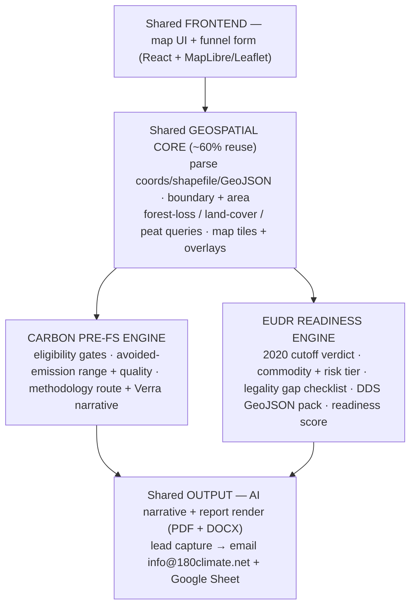

# 180Climate — Whole Application Plan

**Compiled by:** Cowork (planning & orchestration) · **Date:** 2026-06-23
**Grounded in:** `180climate-MASTER-handover-spec.md` (the *what*), Planning Batch 01 / ADR-0001…0010 (the *locked decisions*), `core/contracts` (the *constitution*), and `docs/orchestration-v2.md` (the *build method*).
**Build window:** now → ~5 Jul 2026.

> This is the single read that answers "what are we building and how do we get there." It folds the master spec + the locked ADRs + the orchestration redesign into one plan.

---

## 1. What you're building (in one breath)

A **public web platform = two diagnostic engines on one shared geospatial core**, run as a **lead-generation + data-collection funnel** for 180Climate's consulting business — and doubling as John's public FDE/solutions-architect portfolio.

1. **Carbon Pre-FS Engine** — a concession holder/developer enters contact details + a concession location (coords or shapefile) and gets a free, ~80% "gut-feel" pre-feasibility read: carbon-credit **quantity range + quality**, a deforestation/condition verdict, a map, and a defensible AI rationale. It replaces a ~SGD 12K paid pre-feasibility study.
2. **EUDR Export Readiness Engine** — an Indonesian commodity exporter enters plot(s) + commodity and gets a **deforestation-free verdict vs the 31 Dec 2020 cutoff**, an Indonesia risk-tier read, a legality **gap checklist**, and a **DDS-ready GeoJSON pack** + readiness score.

**The free output is the carrot.** The real value 180Climate captures is the **lead + concession data** and the warm path to a paid follow-up: full feasibility study (site visit, ground sampling, drone LiDAR), financial model, fundraising, and full DDS preparation.

**The non-negotiable spine:** the **runtime is a deterministic calculator**; AI only *writes the explanation*. Numbers/verdicts are reproducible, testable, and cheap. Multi-agent is the *build method*, never a live show for visitors.

---

## 2. Who it's for (tune trust to #1)

| User | Question they arrive with | Engine |
|---|---|---|
| **Concession holder / developer** ← #1 audience, the deal lead | "Is my land worth a carbon project?" | Carbon |
| Investor / funder | "Gut-feel feasibility before I diligence?" | Carbon |
| Indonesian exporter to EU | "Can I prove my plots are deforestation-free for EUDR?" | EUDR |
| Recruiters / peers | "Can John architect + ship this?" | Both (public repo) |

Rival developers and skeptical funders **will** scrutinise the output, so it must look professional and be **defensible** — and explicitly **non-binding** with a brief (not legalistic) disclaimer.

---

## 3. The "60-second wow" (the two user flows)

- **Carbon:** enter info + location → deforestation verdict + map + carbon estimate (quantity range + quality, ~80%) + Verra-family rationale → carrot to book the paid FS / financial model.
- **EUDR:** enter plot(s) + commodity → deforestation-free verdict vs 2020 + Indonesia risk tier + legality gap checklist + DDS-ready GeoJSON pack + readiness score → carrot to 180Climate for full DDS prep.

Funnel gating (ADR-0003): **light capture up front** (name + email → headline verdict + map); the **detailed report + financial-model carrot** is gated behind the full lead form.

---

## 4. Scope — in / out / later

**In (v1):** Carbon (REDD+ and Peat project types); EUDR (palm, rubber, timber + cocoa, coffee for Indonesia); shared geospatial core; map UI + funnel + lead capture; AI narrative; deterministic calc; deploy to `app.180climate.net` + public GitHub.

**Out / later (architect so they *slot in*, not bolt on):** ARR & Mangrove project types; multi-methodology optimization (a consultation carrot); CRM integration; authenticated dashboard; richer peat-depth modelling.

**Order (ADR-0005):** Carbon vertical first (a shippable milestone on its own) → EUDR fast-follow reusing the core.

---

## 5. Architecture — shared core + two verticals



**Stack (free-tier-friendly, portfolio-credible):** Python + FastAPI; geopandas / rasterio / shapely; React + MapLibre/Leaflet frontend; Claude for the *narrative only* (the one model-in-the-loop step); host static frontend free tier, API on a free/cheap tier; standalone app on `app.180climate.net` linked from the Wix site (ADR-0002).

**Repo (monorepo `180climate-app/`):**
```
docs/      methodology.md, ADR-000x, spec, application-plan.md, orchestration-v2.md
core/      geospatial core (shared) + core/contracts/ (the typed constitution)
engines/   carbon/  (eligibility, methodology routing, estimate)
           eudr/    (cutoff verdict, risk tier, legality checklist, DDS pack)
narrative/ AI rationale (prompt templates per engine) — the only LLM call
frontend/  map UI + funnel
api/       FastAPI routes
tests/     golden-case fixtures + unit tests
coordination/  the agent mailbox + board (already built)
```

**Module-boundary rule:** the **typed contracts** (`core/contracts/`) are defined first and are the constitution — agents only change code behind their own interface; a shared-type change needs an ADR + Gate C. The contracts already pin every structure: `CarbonInput`, `EligibilityResult`, `MethodologyRoute`, `CarbonEstimate`, `EUDRInput`, `PlotVerdict`, `EUDRVerdict`, `LeadCapture`, and config (`CarbonGates`, `EUDRConfig`).

---

## 6. Carbon engine — the logic

**Eligibility hard gates** (config-driven, `CarbonGates`):

| Gate | Rule | Fail |
|---|---|---|
| Permit type | valid **HTI or HA** | no permit → hard NO |
| Permit remaining | **> 5 years** | flag / soft-no |
| Area | **≥ 20,000 ha** | below → not viable v1 |
| Location | inside the IUP boundary | outside → flag |

**Estimate:** Quantity ≈ eligible area × carbon density (biomass or peat-carbon/ha) × project-type factor × baseline loss-rate × risk/buffer deductions → output a **range** (`quantity_low_tco2e`…`quantity_high_tco2e`), never a single false-precise number. Quality ≈ additionality + permanence + leakage + methodology fit.

**Methodology routing (ADR-0001 — the defensible centerpiece):** engine is **methodology-agnostic** (transparent avoided-emissions math); the *narrative* cites the correct Verra family **by permit type**:

| Permit / type | Baseline class | Verra family cited |
|---|---|---|
| **HTI** (clear-fell right) | planned clear-fell foregone | **APD route** (VM0009/legacy — advisor-confirm) |
| **HA** (selective-log right) | planned selective-logging foregone | **IFM** (VM0010 / VM0045 v1.2) |
| **Peat** | avoided drainage/subsidence | **VM0027 interim** — advisor-confirm; standalone peat method pending |
| *(reference only)* unplanned loss (AUD) | — | VM0048+VMD0055+VT0007 — **NOT** used for foregone-harvest baselines |

**Critical rule:** the HTI/HA foregone-legal-harvest baseline is **PLANNED → APD/IFM**, never the unplanned VM0048 family; the app **never brands to the deprecated VM0007**. Additionality basis stated explicitly in the narrative: **"legal harvest right foregone."**

---

## 7. EUDR engine — the logic (~60% reuses the carbon core)

What's new vs carbon: **opposite verdict framing.** Any deforestation **after 31 Dec 2020** within a plot = **non-compliant** (disqualifying), using the **JRC Global Forest Cover 2020** reference layer.

- **Commodities:** palm, rubber, timber, cocoa, coffee (tag each plot).
- **Geometry:** **polygons required > 4 ha**, points allowed ≤ 4 ha; **plot-list / batch** ingest; **no** min-size gate (unlike carbon's 20,000 ha).
- **Legality dimension** (not satellite-derivable): land-use rights, environmental laws, third-party rights, labour, anti-corruption, trade → rendered as a **gap-analysis checklist / attestation** (= the service carrot).
- **Risk classification:** state Indonesia's country risk tier (low/standard/high) and adjust due-diligence depth.
- **DDS output:** a **GeoJSON pack aligned to EU TRACES** + a "missing evidence" gap report + a **readiness score (0–100)**.
- **Roles & deadlines (config-driven — already delayed twice):** Operator vs Trader; **operators 30 Dec 2026, SMEs 30 Jun 2027** (Reg (EU) 2025/2650); tell the user which applies; label "as of Jun 2026."

---

## 8. Defensibility spine — determinism, uncertainty, methodology

- **Determinism invariant:** the number/verdict path is pure functions + the typed models; **the only place an LLM is called is the narrative**. Enforced by the contract-guard hook + golden cases.
- **Uncertainty (ADR-0009):** always a **range + an uncertainty band + an IPCC-Tier label** (free satellite = Tier 1 screening; hi-res/LiDAR = toward Tier 2; field + accredited method + verification = Tier 3 registry-grade). **Never** a single bare number, **never** a "% accuracy/confidence." The narrative states plainly that **the baseline — not the satellite — is the dominant uncertainty.**
- **Data sources (ADR-0007, free tier, swappable behind an interface):** GFW/Hansen (loss), RADD (alerts), JRC GFC2020 (EUDR baseline), ESA WorldCover, ESA CCI Biomass/JAXA (biomass proxy), peat maps, SRTM/DEM. GEE is **non-commercial only** → flagged in README + ADR; ship on free APIs / self-hosted COGs.

---

## 9. Report generation & lead delivery (ADR-0010)

On the **detailed-report** request (after the full lead form): render the report in **both PDF (user download) and DOCX (internal email)**, same content, filename = creation timestamp `YYMMDDHHMM` (shared base for both files). The report **ends with the "Engage 180Climate" CTA** (full FS, field validation, methodology/baseline advisory, hi-res/LiDAR, EUDR compliance, project development, market access). On download: **email `info@180climate.net`** with the DOCX attached + the full lead-form details (subject `"{concession} — {filename}"`) **and append the lead to the Google Sheet**. Secrets (email + Sheet creds) live in host config, **never in the repo**. Gate P verifies this end-to-end before go-live.

---

## 10. Locked decisions (the Section-19 open items are now closed)

| ADR | Decision |
|---|---|
| 0001 | Methodology-agnostic engine; Verra family cited by permit type; foregone-harvest = APD/IFM, never VM0048; never brand VM0007 |
| 0002 | Wix can't host a custom app → **standalone app on `app.180climate.net`**, linked from Wix |
| 0003 | **Light capture up front**; detailed report + financial-model carrot gated behind the full lead form |
| 0004 | Lead store: **email `info@180climate.net`** (primary) + **Google Sheet** append; runtime uses its own creds |
| 0005 | **Carbon first → ship → EUDR fast-follow** reusing the shared core |
| 0006 | Peat: agnostic + advisor-confirm, presented as a transparent range, never branded to VM0027 |
| 0007 | Free-tier data behind a swappable interface; GEE non-commercial flagged |
| 0008 | Execution surfaces & models (now redefined in `orchestration-v2.md`) |
| 0009 | Uncertainty: range + band + IPCC-Tier; never a single number or "% accuracy" |
| 0010 | Report in PDF + DOCX, timestamped, emailed + Sheet-appended, ends with 180Climate CTA |

*(Proposed next: **ADR-0011 — orchestration v2** to ratify the redefined roles.)*

---

## 11. Build roadmap — phases, Work Orders, gates

Vertical slice first, then widen; a human gate at every phase boundary. The **build method** is `orchestration-v2.md`: VS Code = builder, Cowork = planner/evaluator, you decide at gates, the Claude.ai project is an optional advisor.

```mermaid
flowchart LR
  WO000["WO-000<br/>scaffold + contracts<br/>+ .claude harness + CI"] --> G0{{"Gate 0<br/>John: scaffold + contracts + ADR-0001"}}
  G0 --> WO001["WO-001<br/>vertical slice<br/>(end-to-end, ugly but real)"] --> G1{{"Gate 1<br/>John: slice green end-to-end"}}
  G1 --> P2["Phase 2 — Carbon engine (parallel worktrees)<br/>WO-CARBON-001 data · 002 golden cases · 003 eligibility+routing · 004 estimate range+quality · 005 narrative"]
  P2 --> GM{{"Gate M<br/>John: numbers · routing · disclaimers"}}
  GM --> P3["Phase 3 — EUDR fast-follow<br/>verdict · compliance/risk · DDS pack · UI"]
  P3 --> GE{{"Gate E<br/>John: EUDR verdict logic"}}
  GE --> P4["Phase 4 — integrate · harden · lead pipeline live"]
  P4 --> GP{{"Gate P — PII / lead flow"}} --> GL{{"Gate L — go-live"}}
```



| Phase | Work Orders | Definition of done | Gate |
|---|---|---|---|
| **0 — Foundations** | WO-000: monorepo, `core/contracts/`, `.claude/` harness, `coordination/` (done), green CI, private repo + protected `main` | tree per §12, contracts type-check, CI green, no secrets | **Gate 0** |
| **1 — Vertical slice** | WO-001: one concession → parse → area → GFW loss → placeholder number → map + verdict + AI rationale → capture → email | works end-to-end on one golden case, deterministic | **Gate 1** |
| **2 — Carbon engine** | WO-CARBON-001 data · -002 golden cases · -003 eligibility + methodology routing *(Opus, high-stakes)* · -004 estimate range + quality · -005 narrative + Verra rationale | all four gates correct on golden cases; range + IPCC tier; additionality wording; map overlay | **Gate M** |
| **3 — EUDR** | verdict (2020 cutoff + JRC layer) · compliance (commodity, risk tier, legality checklist) · DDS GeoJSON pack + readiness · UI | correct verdict on golden cases; valid TRACES-aligned pack; deadline from config | **Gate E** |
| **4 — Ship** | verification harness, README + architecture diagram + methodology notes + disclaimers, deploy, lead pipeline live | reproducible free-tier deploy; lead email + Sheet verified | **Gate P → Gate L** |

**Loops with limits everywhere:** per-WO fix loop retry budget **2 → STOP** + QUESTIONS; Verifier re-verify ≤ 2; self-improving CoV = 1 rewrite on high-stakes outputs. **Cost:** all Opus 4.8, parallel fan-out capped (~3) so the carbon-engine parallel phase doesn't stall on the weekly cap.

---

## 12. Acceptance criteria (Definition of Done)

**Carbon:** accepts coords AND shapefile/GeoJSON (clear error on malformed); applies all four hard gates correctly on golden cases; routes methodology by permit type and names the right Verra family; produces a **range** with stated uncertainty; rationale states "legal harvest right foregone"; map with forest-loss overlay + brief disclaimer; lead captured + delivered.

**EUDR:** accepts a plot list (polygons > 4 ha, points ≤ 4 ha, no min-size); correct deforestation-free / non-compliant verdict vs **31 Dec 2020** on golden cases; tags commodity; states Indonesia risk tier + legality checklist; exports a valid GeoJSON DDS pack + readiness score; states the applicable deadline from config.

**Cross-cutting:** deterministic (same input → same output, no LLM in the number path); golden-case fixtures committed; CI green; README + architecture diagram + methodology notes + disclaimers; no secrets; reproducible free-tier deploy.

---

## 13. Top risks → mitigations

Methodology dispute → agnostic transparent calc + route by permit + advisor-confirm. · VM0007 dating the app → anchor to the verified registry, never brand to it. · EUDR dates shift again → config-driven, labelled "as of Jun 2026." · Free data too coarse → state uncertainty bands; position FS as the precision upgrade. · GEE non-commercial → self-hosted COGs / free APIs. · Additionality challenged → lead with foregone-legal-harvest + golden-case tests + visible sources. · Parallel agents collide → contracts first; ADR for shared changes. · Lead data lost → Sheet backup. · Platform can't embed → standalone hosted app.

---

## 14. Where we are right now

Repo currently holds the planning docs + the **coordination layer Cowork just stood up** (`coordination/` + `docs/orchestration-v2.md` + this plan). **Nothing is scaffolded yet — WO-000 has not run.** The immediate next step is the planner's hand-off: **ADR-0011 (orchestration) + the concrete WO-000 step list + `.claude/` harness templates** → you trigger VS Code once → Gate 0.
