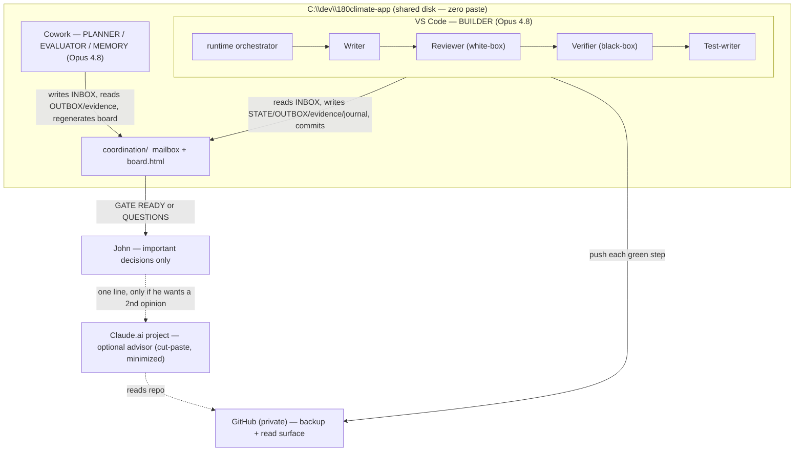

# 180Climate — Orchestration v2 (goal-first redesign)

**Date:** 2026-06-23 · **Author:** Cowork (planning & orchestration) · **Status:** proposed, supersedes the role/communication parts of `Plan.pdf` and `180climate-build-and-orchestration-plan.md`.

> This redesign keeps every **app** decision in the existing docs (the carbon/EUDR
> spec, the ADRs, the contracts, the Work Orders). It only **redefines the roles,
> communication, and control loops** — because the original role map optimised for
> "the architect controls everything," and your real goal is "minimum cut-paste,
> human only on important calls." Roles are means; the goal is the end.

---

## 0. The one goal (the only fixed thing)

Ship a **defensible carbon + EUDR pre-feasibility web app** such that:

1. **John cut-pastes almost nothing** — ideally never on the critical path.
2. **John is pulled in only for important decisions** (numbers, methodology, PII, go-live).
3. The **number/verdict path is deterministic** (no model in the math).
4. **Quality is enforced by layered evaluators** that **learn over time**.

Everything below is derived from these four. If a rule ever fights the goal, the goal wins and the rule changes (via a one-line ADR).

---

## 1. The reframe that drives the whole design

There are four actors. **Only one of them is blind to the repo folder** — the Claude.ai project. It can read your work *only* via GitHub or a paste. **Therefore the Claude.ai project is the single source of every cut-paste.**

The consequence is decisive:

- The **critical build path must run entirely on the two folder-aware agents** (Cowork + VS Code), which exchange state through files with **zero paste**.
- **Independent review** — the thing that stops an agent rubber-stamping its own work — does **not** require the cut-paste surface. Cowork and VS Code are **separate agents with separate context windows**, so Cowork reviewing VS Code's output already *is* an independent check, for free.
- The Claude.ai project is therefore **demoted** from "the Brain that runs everything" to an **optional outside advisor**, used only when you *want* a second opinion on a less-critical question. It never blocks the build.
- **Humans handle the important calls; the cut-paste surface handles the least-critical ones.** Exactly the inversion you asked for.

---

## 2. Redefined roles

| Actor | New role | Owns | Never | Model |
|---|---|---|---|---|
| **VS Code Claude Code** | **Builder** (autonomous engine) | writes/runs/commits code; runs the inner Writer→Reviewer→Verifier→Test loop per Work Order; writes `STATE/OUTBOX/evidence/journal`; regenerates `board.html` each step | changes a shared contract without an ADR | Opus 4.8 |
| **Cowork (this agent)** | **Orchestrator / Planner / Evaluator / Memory-keeper** + your console | turns the goal+spec into concrete Work Orders & acceptance criteria; **independently reviews** VS Code's evidence (no paste); runs the self-improving CoV on high-stakes outputs; runs the Dreaming/consolidation pass; keeps the board honest; decides what's important enough to escalate to John | writes production app code | Opus 4.8 |
| **John (human)** | **Decision authority** — important calls only | the gates that define *truth*: numbers/methodology, contract changes, PII/lead flow, EUDR verdict logic, go-live, and the Phase-0/1 foundations | — | — |
| **Claude.ai project** | **Optional outside advisor** (off critical path) | a sparingly-used second opinion on less-critical strategy; verifying this design against the *latest* Anthropic docs (it can browse) | block the build; require document pasting | Opus 4.8 |

**Why two "orchestrators" don't collide:** VS Code orchestrates **at runtime** (every build step, inside a phase). Cowork orchestrates **at planning cadence** (between phases / on a schedule). Different clocks, one shared folder, async — neither waits on the other.

---

## 3. Communication — how Cowork and VS Code talk

The channel is the **`coordination/` folder** in the repo (already created). It is the *only* way the two agents exchange state — no app-to-app wire, no paste.

| File | Single source of truth for | Written by |
|---|---|---|
| `STATE.md` | phase · active WO · status · last commit · next step | VS Code (each step) |
| `INBOX.md` | the task right now | Cowork (planner) |
| `OUTBOX.md` | last result + links into `evidence/` | VS Code |
| `QUESTIONS.md` | blockers/ambiguities — **non-empty = pull a human** | whoever is blocked |
| `GATE.md` | phase-boundary signal — `GATE x READY` + evidence pointers | VS Code |
| `evidence/` | per-WO: CI output, golden-case results, screenshots, Verifier report | Verifier + VS Code |
| `journal.md` | append-only episodic log (feeds Dreaming) | both |

**Your window: `coordination/board.html`** — self-contained (double-click, no server), **regenerated after every step** by `coordination/render_board.py` (one deterministic command, no model). It renders the mailbox into one glance: phase, active WO, status, last commit, inbox/outbox, questions, gate, recent journal. `BOARD.md` is the zero-tooling twin for VS Code's Markdown preview.

**The only two signals that interrupt you:** `QUESTIONS.md` non-empty, or `GATE.md` = READY.

---

## 4. Minimising cut-paste to the Claude.ai project

Because the Claude.ai project is now **off the critical path**, the build never waits on it and never pastes into it. You consult it **only when you choose**, and even then with no document shuttling:

1. Connect the Claude.ai project to **GitHub** (Settings → Connectors → GitHub → authorize `180climate-app`).
2. To get its opinion, send **one line**: *"Look at the repo — what do you think of X?"* It reads commits/`evidence/` itself.
3. Best use of it: a true **outside check** on the highest-stakes call (the carbon numbers/methodology) or to confirm this design against the **latest** Anthropic guidance.

That is the entire cut-paste budget: optional, one line, only when you want a second brain.

---

## 5. The harness (Anthropic best practice — `.claude/`)

WO-000 builds this; templates below are ready to adopt.

- **`CLAUDE.md`** — the constitution: the §0 goal, the invariants (determinism, no secrets, brief disclaimers, all lead email → `info@180climate.net`), the loop, the folder protocol, who-writes-what.
- **`settings.json`** — permissions + **hooks** (deterministic guardrails, no model needed):
  - `secret-scan` — block commits containing secrets;
  - `contract-guard` — block edits to `core/contracts/*` unless an ADR is present (your "constitution changes only via ADR" rule, enforced);
  - `verifier-no-edit` — the Verifier may run commands but **never edit** (so failure evidence survives);
  - `dangerous-bash` veto;
  - `Stop`-hook gate — a phase can't "finish" until acceptance criteria are met and the board is regenerated.
- **`agents/`** — subagents: `planner`, `writer`, `reviewer`, `verifier`, `test-writer`, `narrator`.
- **`commands/`** — `/wo` (load next Work Order), `/gate` (assemble gate pack), `/board` (regenerate), `/consolidate` (Dreaming pass).
- **`skills/`** — `methodology` (Verra routing by permit type), `geospatial`, `golden-case`, `brand-180climate`, `self-improving-code`, `self-improving-agent`.

---

## 6. Multi-agent orchestration (patterns)

- **Orchestrator–workers:** VS Code's orchestrator dynamically spawns Writer/Reviewer/Verifier/Test per Work Order (use a dynamic workflow / `/goal` to run a whole phase hands-off).
- **Evaluator–optimizer:** Verifier + golden cases evaluate; Writer optimizes; **bounded** to ≤2 fix cycles.
- **Routing:** methodology routing by permit type (HTI→APD/IFM, HA→IFM, Peat→interim) lives in the `methodology` skill and is pinned by golden cases.
- **Prompt chaining (deterministic):** parse → boundary+area → forest-data → estimate **range** → narrative; **only the narrative step calls a model.**
- **Independent cross-agent review:** Cowork (planner/evaluator) ⟂ VS Code (builder) — the anti-self-approval check, with no paste.

---

## 7. Evaluators & quality gates (cheapest first)

| Tier | Check | Runs | Decides |
|---|---|---|---|
| 0 — automated | lint, type-check, unit tests, **golden cases**, contract-guard, secret-scan, **determinism** (same input→same output; no `%`/single carbon number) | every commit (CI blocks merge on red) | machine |
| 1 — agentic | **Reviewer** (white-box: diff vs contracts) · **Verifier** (black-box: runs product vs spec §15, screenshots UI) → PASS / FAIL / CLARIFY | each high-stakes WO | agents |
| 2 — self-improving | **Cowork runs the self-improving-agent CoV** (draft→adversarial verify→rewrite) on the carbon engine, EUDR verdicts, the report | high-stakes outputs only | Cowork |
| 3 — human gates | **Gate 0** scaffold · **1** slice · **M** numbers/methodology · **C** contract change · **P** PII/lead · **E** EUDR verdict · **L** go-live | phase boundaries | **John (truth)** |

Agents prove *conformance*; **John defines truth.**

---

## 8. Loops with limits (rational, anti-runaway, cost-aware)

- **Per-WO fix loop:** retry budget **2 → STOP** + write `QUESTIONS.md`. No infinite thrash.
- **Re-verify:** ≤2 cycles after a fix.
- **CoV (self-improving):** HIGH = 1 rewrite · MEDIUM = verify only · LOW = skip.
- **Cost guard (Max 20x):** **all surfaces Opus 4.8**; the only knob is **parallel fan-out width** — keep concurrent Opus sub-agents **≤ ~3**, reserve the widest fan-out for the carbon-engine phase, and degrade *pure-plumbing* steps to Sonnet 4.6 **only if** you start hitting the weekly cap. (All-Opus is what you asked for; this just stops it from stalling you.)

---

## 9. Memory & "Dreaming"

A best-practice memory hierarchy so the system **learns and you stop re-explaining**:

- **Working memory:** `.claude/CLAUDE.md` + `coordination/STATE.md` (always in context).
- **Episodic log:** `coordination/journal.md` (append-only, one line per step).
- **Long-term memory:** `memory/` (consolidated durable facts + lessons).
- **Dreaming = periodic consolidation** (`/consolidate`, or Cowork on a schedule, at gate boundaries — never mid-WO): read `journal.md` since the last pass → distill durable lessons (what white-box review caught vs. what *only* the black-box Verifier caught, recurring ambiguities, prompt fixes) → write to `memory/` → prune noise. This is the "build a pattern library over time" idea from the Verifier learning summary, operationalised.

---

## 10. What changed vs. the original docs (and why)

1. **Claude.ai project demoted** (architect-of-everything → optional advisor). *Why:* it's the only paste source; shrinking it shrinks your paste.
2. **Cowork promoted** (optional scheduled planner → orchestrator/planner/evaluator/memory). *Why:* it's folder-aware (zero paste) and Opus 4.8, so it can own planning + independent review that previously forced Brain round-trips.
3. **Independent review relocated** to Cowork (separate agent, same folder). *Why:* keeps anti-self-approval independence **without** paste.
4. **Memory/Dreaming added.** *Why:* the system learns; you don't repeat yourself.
5. **Human-in-the-loop tightened** to two signals only. *Why:* your stated goal.
6. **Models:** honour all-Opus, add a parallel-width cap. *Why:* protects the save-time goal from cap stalls.

These touch **only** roles/communication/loops. If you want any of them recorded as binding, they become **ADR-0011 (orchestration v2)** — and that's a good first thing to let the Claude.ai advisor sanity-check against the latest Anthropic docs.

---

## 11. How you run it day-to-day (your 3 moves; everything else is automatic)

1. **Once per phase:** in VS Code, say *"use a workflow"* or `/goal` — it runs the whole phase (build → review → verify → fix → commit → push), regenerating `board.html` each step.
2. **Whenever you like:** double-click `coordination/board.html` to watch.
3. **Only on a signal:** when the board shows **GATE READY** or a **QUESTION**, make the call. If it's a less-critical strategic question and you want a second opinion, send the Claude.ai project one line. That is the only paste, and it's optional.
